# Joy PeopleHR / WorkForceOS Enterprise — Architecture, Governance & Security Report

**Document Version:** 2.4.0  
**Generated Date:** August 31, 2026  
**Target Environment:** Production Cloud (`https://joypeoplehr.com`)  
**Platforms Supported:** Web Enterprise Portal (React 19 + Vite 6 + Node.js) & Mobile Application (Flutter Multi-Platform)  
**Database & Auth Engine:** Supabase Enterprise Cloud (PostgreSQL 15 + RLS + Realtime Sync)

---

## 1. Executive Summary

Joy PeopleHR (WorkForceOS Enterprise) is a next-generation Human Resource Management and Contractor Governance SaaS platform. It unifies permanent workforce management, statutory compliance, automated payroll calculation, and third-party vendor labor governance into a single cohesive platform.

This report outlines:
1. The structural distinction between **Internal HR Core** and **Vendor & Contractor Governance**.
2. The end-to-end **4-Stage Vendor Governance Lifecycle**.
3. Enterprise **Security Hardening, Anti-Session-Hijack Defense, and CORS Policies**.
4. Multi-platform cloud synchronization between **Web** and **Flutter Mobile App**.
5. Live production deployment specifications on **Hostinger Cloud**.

---

## 2. Structural Comparison: HR Core vs. Vendor Governance

A frequent point of confusion in HRMS architectures is why HR Core and Vendor Governance contain similar modules (e.g. Attendance, Wages, PF/ESI, Payslips). Below is the core architectural breakdown:

```
┌─────────────────────────────────────────────────────────────┐
│  🏢 HR CORE  =  "MANAGE & PAY OUR OWN PEOPLE"              │
│  (Direct Employee Onboarding, Company Payroll & Leaves)     │
└─────────────────────────────────────────────────────────────┘

                             VS

┌─────────────────────────────────────────────────────────────┐
│  🤝 VENDOR GOVERNANCE  =  "AUDIT & APPROVE OUTSIDE AGENCIES"│
│  (Verify vendor licenses, check contractor gate punches,    │
│   and approve vendor invoices via 3-Way Match)              │
└─────────────────────────────────────────────────────────────┘
```

### Detailed Functional Matrix

| Dimension | 🏢 HR Core (Internal Permanent Staff) | 🤝 Vendor & Contractor Governance |
| :--- | :--- | :--- |
| **Employment Nature** | Direct, permanent employees on company rolls. | External contractors employed by third-party staffing agencies (e.g., Apex Staffing). |
| **Salary / Financials** | Company calculates monthly gross-to-net salary and deposits directly into employee bank accounts. | The vendor pays their workers. The company pays **only the vendor's consolidated invoice**. |
| **Attendance Purpose** | Calculates working days, paid leaves, overtime, and salary deductions for internal staff. | **Gate Pass & Audit:** Verifies contractor shift presence at factory/office gates to prevent inflated billing. |
| **PF / ESI Compliance** | Direct company compliance; statutory deductions are remitted directly to EPFO/ESIC by the company. | **Audit Radar:** Principal employer verifies that the vendor submitted PF/ESI for workers before invoice payout (CLRA compliance). |
| **Settlement Method** | Direct Salary Slips (Form 16 / Payslips). | **3-Way Match:** `Purchase Order` + `Gate Attendance Logs` + `Vendor Tax Invoice`. |

---

## 3. End-to-End Vendor Governance Lifecycle

To eliminate cognitive overload, the vendor governance suite is organized into **4 Streamlined Workspaces**:

```mermaid
flowchart LR
    subgraph Step1["1. ONBOARDING & SETUP"]
        V[Vendor Directory] --> L[Labor Licenses & Form V]
        L --> W[Contractor Roster & Sites]
    end

    subgraph Step2["2. OPERATIONS & TIME"]
        W --> A[Biometric / Gate Attendance]
        A --> OT[Overtime & Shift Audit]
    end

    subgraph Step3["3. SETTLEMENT & 3-WAY MATCH"]
        OT --> WB[Wage Breakdown]
        WB --> INV[Vendor Invoice & PO]
        INV --> MATCH[3-Way Match & Approval]
    end

    subgraph Step4["4. COMPLIANCE & AUDIT"]
        MATCH --> STAT[PF/ESI Challan Verification]
        STAT --> AUDIT[Audit Trail & Payment]
    end

    Step1 --> Step2 --> Step3 --> Step4
```



### 1. 🏢 Vendor & Workforce Hub
- **Vendor Directory:** Profiles, contracts, active agencies, and vendor contact persons.
- **Licenses & Expiry Radar:** Automated OCR scanner for Contract Labor Licenses, PAN, GSTIN, and expiration warning alerts.
- **Deployments & Gate Pass:** Contractor workforce rosters assigned to specific branches, factories, or project sites.

### 2. ⏱️ Contractor Time & Attendance
- **Gate Punch Logs:** Real-time check-in/out tracking for contractor staff via biometric / RFID / mobile scanning.
- **Overtime & Shift Audit:** Identifies contractor overtime hours to prevent discrepancies during billing.

### 3. 💳 Settlement & 3-Way Match Engine
- **Purchase Orders (POs):** Contractual rate cards per worker designation (e.g. ₹650/day).
- **Wage Breakdown Calculation:** Automatically computes the baseline labor cost based on verified attendance logs.
- **3-Way Matching:** Compares `Purchase Order` vs `Actual Gate Hours` vs `Vendor Submitted Invoice`. Flags billing discrepancies automatically before approval.

### 4. 🛡️ Statutory & Compliance Radar
- **Form V & Labor Returns:** Centralized generation and storage of statutory labor filings.
- **PF/ESI Challan Audit:** Verification that third-party vendors deposited statutory dues for their deployed workforce.
- **Compliance Calendar:** Tracks upcoming renewal dates for labor licenses and vendor contracts.

---

## 4. Security Architecture & Anti-Session-Hijack Engine

To secure the SaaS production environment against credential theft, token exfiltration, and cross-device session transfers, the following enterprise security controls are active:

### 1. Cryptographic Device Fingerprint Binding (`sessionProtection.ts`)
- Computes a client environment signature from `User-Agent`, operating system platform, screen resolution, timezone, and language using a hybrid DJB2 + FNV-1a hash algorithm.
- Dynamically binds authenticated sessions to the active device.
- If a session token or storage snapshot is copied to an unauthorized computer or browser profile, the system detects the signature mismatch and **instantly purges the session, forcing re-authentication**.

### 2. SaaS Ephemeral Session Isolation
- Persistent `localStorage` credentials have been phased out in favor of isolated `sessionStorage` and in-memory Supabase sessions.
- Prevents cross-profile leakage on shared workstations.

### 3. Production Server Security Headers (`server.js`)
- `X-Frame-Options: SAMEORIGIN` — Clickjacking protection.
- `X-Content-Type-Options: nosniff` — MIME-sniffing prevention.
- `X-XSS-Protection: 1; mode=block` — Cross-site scripting shield.
- `Strict-Transport-Security: max-age=31536000; includeSubDomains; preload` — Enforces HTTPS.
- `Referrer-Policy: strict-origin-when-cross-origin`.

### 4. Strict CORS Whitelist & Edge Function Protection
- Cross-Origin Resource Sharing is locked down to authorized domains:
  - `https://joypeoplehr.com`
  - `https://www.joypeoplehr.com`
  - `capacitor://localhost`, `ionic://localhost`, and mobile application user agents.
- Shared CORS preflight handler implemented for Supabase Edge Functions (`security-engine` and `employee-auth-provisioner`).

---

## 5. Multi-Platform Synchronization (Web + Flutter Mobile)

```
┌────────────────────────────────────────────────────────┐
│               Supabase Cloud Database                  │
│       https://wmqjmyzzamgxyeuotbki.supabase.co         │
└───────────────────▲────────────────┬───────────────────┘
                    │                │
            Realtime Sync     Realtime Sync
                    │                │
     ┌──────────────┴──────┐  ┌──────┴──────────────┐
     │    Web Portal       │  │ Flutter Mobile App  │
     │  joypeoplehr.com    │  │  (iOS & Android)    │
     └─────────────────────┘  └─────────────────────┘
```

- Both the **Web Application** and the **Flutter Mobile App** query the same live Supabase database.
- Any action taken on mobile (such as an employee attendance punch or leave request) immediately reflects on the web admin dashboard in real-time.
- Database changes made on the web portal (such as adding an employee or approving a license) sync instantly to the mobile application.

---

## 6. Continuous Integration & Deployment (CI/CD)

- **GitHub Repository:** `dharun-b-1912 / Joy-PeopleHR`
- **Workflow Path:** `.github/workflows/ci.yml`
- **Automated Pipeline:**
  1. Triggered on every `git push` to `main`, `master`, and `develop`.
  2. Runs `npm ci` with caching.
  3. Executes `npm run typecheck` (`tsc --noEmit`) to verify strict typing.
  4. Builds production bundle (`npm run build`).
  5. Packages and archives production `dist/` artifacts.

---

## 7. Production Deployment Status

- **Production URL:** [https://joypeoplehr.com](https://joypeoplehr.com)
- **Deployment Platform:** Hostinger Cloud Node.js Runtime
- **Server File:** `server.js` (Express Production Gateway)
- **Build Status:** `completed` (Build UUID: `01a05777-37f3-714a-9e71-01a98506a6a5`)
- **Health Check Endpoint:** `https://joypeoplehr.com/api/health` $\rightarrow$ `{"status":"ok","environment":"production","security_engine":"active"}`

---

## 8. Credentials & Testing Reference

| Portal Role | Gateway / Tab | Test Identifier / Email | Test Password |
| :--- | :--- | :--- | :--- |
| **Super Admin** | Platform Staff (`/superadmin`) | `superadmin@joypeoplehr.com` | `Password@123` |
| **Company Admin / HR** | Customer / Tenant | `admin@joypeople.com` | `Password@123` |
| **Vendor Admin (Apex Staffing)** | Vendor Portal | `vendor@apexstaffing.in` | `demo1234` *(or 1-Click Login)* |
| **Employee Self Service** | Customer / ESS | Registered Employee Work Email / Mobile | `Password@123` |

---

*Joy PeopleHR Enterprise Architecture Documentation • Confirmed and Verified for Production Release.*
