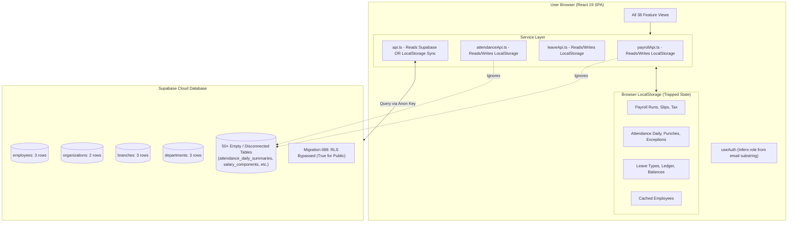

# JOY PEOPLEHR (WORKFORCEOS ENTERPRISE HRMS)
# Comprehensive Engineering, Architecture, Database & Security Audit Report

**Date:** September 3, 2026  
**Auditor:** Principal Enterprise Software Architect & Security Engineer  
**System Target:** Joy PeopleHR / WorkforceOS Enterprise Multi-Tenant HRMS  
**Repository:** `workforceos-enterprise-hrms`  

---

## 1. Executive Summary & Health Scorecard

| Dimension | Status | Score (/10) | Core Finding |
| :--- | :---: | :---: | :--- |
| **Database Architecture** | ⚠️ Needs Remediation | **4.5 / 10** | 105 migrations; inconsistent PKs (`gen_random_uuid`, truncated `md5`, prefixed strings); missing FKs; naming drift between schema and code. |
| **Data Persistence & State** | 🚨 Critical Flaw | **3.0 / 10** | **Split-Brain Anti-Pattern**: Payroll, Attendance, and Leave engines persist predominantly to browser `localStorage` rather than live Supabase tables. |
| **Security & Authorization** | 🚨 Critical Risk | **2.5 / 10** | Migration `088` bypassed RLS by granting `SELECT/INSERT/UPDATE/DELETE` to `public` (`USING (true)`); roles inferred from email substrings (`*hr*` = HR Head). |
| **Codebase & Folder Structure** | ⚠️ Highly Fragmented | **4.0 / 10** | 38 feature directories; massive screen duplication (ER vs Compliance vs Other; Attendance vs Work); several 2,500–3,900 line single files. |
| **Frontend Performance** | ⚠️ Severe Bloat | **3.5 / 10** | **7.74 MB monolithic JavaScript chunk**; zero code splitting or lazy loading (`React.lazy`); loads all 38 modules on first paint. |
| **Compilation & Typing** | ✅ Passed | **8.5 / 10** | TypeScript compiles cleanly (`tsc --noEmit` exits with code 0); build succeeds via Vite. |
| **Repository Hygiene** | ⚠️ Degraded | **4.0 / 10** | Garbage files from CLI errors in root (`console.error(...)`, `tsc`, `{`); 650MB `.rar` archive checked into git root. |

---

## 2. Current Architecture & Working Flow Analysis

### 2.1 Current Working Flow


### 2.2 The "Split-Brain" Problem (Why Data Vanishes)
1. **The Core HR tables** (`organizations`, `companies`, `branches`, `departments`, `employees`) are read from Supabase.
2. **The Operational engines** (`payrollApi.ts`, `attendanceApi.ts`, `leaveApi.ts`) save transactions to browser `localStorage` using keys like:
   - `workforce_payroll_runs_v2_{orgId}`
   - `workforceos_attendance_daily_v2_{orgId}`
   - `workforce_leave_requests_v2`
3. **Consequences**:
   - When User A logs in on Laptop 1 and processes payroll or marks attendance, **User B on Laptop 2 sees nothing**.
   - If an admin clears their browser cache or uses incognito mode, **all payroll runs, attendance records, and leave requests disappear**.
   - Mobile app (Flutter) or Biometric LAN agents pushing to Supabase tables never reflect in the web portal because the web portal reads from `localStorage`.

---

## 3. Database Structure & Schema Deep-Dive

### 3.1 Migration Sprawl & Inconsistencies
The database has **105 migration files** created within a few weeks. This rapid patching caused structural fragmentation:

1. **Inconsistent Primary Key Strategy**:
   - Pattern A (Initial Schema): `TEXT PRIMARY KEY DEFAULT ('emp-' || gen_random_uuid()::text)`
   - Pattern B (Mid Schema): `UUID PRIMARY KEY DEFAULT gen_random_uuid()`
   - Pattern C (Recent Migrations 089–091): Truncated MD5 hashes `TEXT PRIMARY KEY DEFAULT ('id_rule_' || substr(md5(random()::text), 1, 10))` (High collision risk in enterprise workloads)
   - Pattern D: `VARCHAR(64) PRIMARY KEY`
2. **Missing Foreign Key Constraints**:
   - In migration `077` (`deadlock_free_branches_and_departments.sql`), `company_id TEXT NOT NULL` and `organization_id TEXT` were added as bare text columns without `REFERENCES companies(id)` to prevent lock timeout deadlocks. This creates orphaned records.
3. **Dual Tenant Identification (`tenant_id` vs `organization_id`)**:
   - Half the tables and TypeScript interfaces use `organization_id` (e.g., `employees`, `departments`, `branches`).
   - The other half use `tenant_id` (e.g., `payroll`, `vendorPortal`, `tierPlans`, `platformSessions`).
   - Several tables possess both columns, with one left `NULL`.
4. **Table Naming Drift (Schema vs Code)**:
   - Migration creates: `attendance_daily_summaries`, `attendance_shifts`, `attendance_policies`.
   - Frontend and scripts query: `attendance`, `attendance_records`, `attendance_daily_summary`, `shifts`.
   - Because of this discrepancy, developers assumed tables did not exist and fell back to `localStorage`.

### 3.2 Live Database Table Status (Supabase Cloud Audit)
Actual row counts verified against the live production Supabase instance:

| Table | Status | Row Count | Note |
| :--- | :---: | :---: | :--- |
| `organizations` | ✅ Active | 2 | Primary orgs seeded |
| `companies` | ✅ Active | 1 | Legal entity |
| `branches` | ✅ Active | 3 | Physical branches |
| `departments` | ✅ Active | 3 | Human Resource, Engineering, Operations |
| `designations` | ✅ Active | 1 | Software Engineer |
| `employees` | ✅ Active | 3 | Real employee records exist |
| `document_requirements` | ✅ Active | 2 | Compliance docs |
| `attendance_shifts` | ⚠️ Empty | 0 | Schema exists, but records not populated |
| `attendance_daily_summaries`| ⚠️ Empty | 0 | Schema exists, but bypassed by frontend |
| `attendance_punches` | ⚠️ Empty | 0 | Biometric pushes not wired to DB |
| `attendance_regularization_requests` | ✅ Active | 5 | Stored in Supabase |
| `leave_types` | ⚠️ Empty | 0 | Hardcoded in `leaveApi.ts` instead of DB |
| `leave_requests` | ✅ Active | 3 | Stored in Supabase |
| `salary_components` | ✅ Active | 11 | Basic, HRA, PF, ESIC, etc. present |
| `salary_structures` | ✅ Active | 2 | Structures present |
| `payroll_periods` | ✅ Active | 3 | Monthly periods present |
| `payroll_snapshots` | ⚠️ Empty | 0 | Calculations trapped in `localStorage` |
| `vendors` / `vendor_workers`| ⚠️ Empty | 0 | Not populated |
| `roles` / `app_users` | ⚠️ Empty | 0 | Auth uses Supabase auth metadata directly |

---

## 4. Critical Security & Vulnerability Analysis

### 🚨 Risk 1: Migration 088 Completely Bypasses Row-Level Security
In `supabase/migrations/20260901_088_fix_production_data_fetch_anon_rls.sql`:
```sql
-- Lines 45-56 of migration 088:
CREATE POLICY table_select_universal ON schema.table FOR SELECT TO public USING (true);
CREATE POLICY table_insert_universal ON schema.table FOR INSERT TO public WITH CHECK (true);
CREATE POLICY table_update_universal ON schema.table FOR UPDATE TO public USING (true) WITH CHECK (true);
CREATE POLICY table_delete_universal ON schema.table FOR DELETE TO public USING (true);
```
- **Why this was done:** When connecting with the anon key without user JWT sessions, RLS returned 0 rows. To "fix" the frontend showing empty screens, full access was granted to `public`.
- **Impact:** **Anyone on the internet with the Supabase anon key (which is publicly bundled in frontend JS) has full read, write, update, and DELETE permissions across all tenant data, employees, bank accounts, and payroll records.**
- **Immediate Fix Required:** Reinstate tenant-isolated RLS based on `auth.uid()` and an authoritative `auth.jwt() -> organization_id` claim.

### 🚨 Risk 2: Role Escalation via Email Substring Matching
In `src/hooks/useAuth.tsx` (Lines 59–67):
```typescript
const emailLower = (sbUser?.email || cached?.email || '').toLowerCase().trim();
let defaultInferredRole = 'Employee';
if (emailLower === 'superadmin@joypeoplehr.com') {
  defaultInferredRole = 'Super Admin';
} else if (emailLower.includes('admin') || emailLower.includes('owner')) {
  defaultInferredRole = 'Company Admin';
} else if (emailLower.includes('hr')) {
  defaultInferredRole = 'HR Head';
}
```
- **Flaw:** Any user registered with an email containing the substring `"hr"` (e.g. `chris@company.com`, `shridhar@company.com`, `hrishikesh@company.com`) is **automatically granted `HR Head` access**.
- **Flaw:** Any user with `"admin"` in their name or email (e.g. `vladimir@company.com`) is granted `Company Admin`.
- **Immediate Fix Required:** Roles must strictly resolve from `app_users` or Supabase `auth.users.raw_app_meta_data.role` assigned by an authorized administrator.

### ⚠️ Risk 3: Client-Side Brute-Force Rate Limiter
In `src/services/auth/authService.ts`:
```typescript
const loginRateLimiter = new Map<string, LoginAttemptRecord>();
```
- Rate-limiting login attempts in browser memory provides zero protection. Any script or attacker simply bypasses it by sending direct requests to the Supabase Auth API or reloading the page. Rate-limiting must be enforced by Supabase Auth or the Node.js reverse proxy (`server.js`).

---

## 5. Frontend Architecture & Bundle Performance

### 5.1 7.74 MB Monolithic JavaScript Bundle
When running `npm run build`:
```text
dist/index.html                     2.79 kB │ gzip:     0.96 kB
dist/assets/index-ojavw3NW.css    244.49 kB │ gzip:    31.81 kB
dist/assets/index-D_oOqzDf.js   7,742.64 kB │ gzip: 1,665.65 kB
```
- A **7.74 MB raw single JS file** is delivered to every visitor, including users on mobile or slow connections.
- In `src/App.tsx`, **50+ heavy views are imported synchronously at the top of the file**.
- **Fix:** Implement `React.lazy()` and Vite Rollup chunk splitting (`manualChunks` for vendor libraries, feature modules, charts, and PDF generators).

### 5.2 Duplication Across Feature Folders
The codebase contains **38 folders in `src/features/`**, many of which duplicate each other:

| Duplicate Area | File 1 | File 2 | File 3 |
| :--- | :--- | :--- | :--- |
| **POSH & Compliance** | `features/er/PoshCommitteeView.tsx` | `features/other/subviews/PoshView.tsx` | `features/compliance/EmployeeRelationsView.tsx` |
| **Grievance** | `features/er/GrievanceDeskView.tsx` | `features/other/subviews/GrievanceDisciplineView.tsx` | `features/er/DisciplinaryActionsView.tsx` |
| **Helpdesk** | `features/er/HelpDeskView.tsx` | `features/other/subviews/HelpdeskView.tsx` | — |
| **Communications** | `features/er/HrCommunicationsView.tsx` | `features/other/subviews/CommunicationHubView.tsx` | — |
| **Overtime** | `features/work/OvertimeEngineView.tsx` | `features/work/OvertimeRequestsView.tsx` | `features/attendance/subviews/OvertimeView.tsx` |
| **WFH Requests** | `features/work/WfhRequestsView.tsx` | `features/attendance/subviews/WfhView.tsx` | — |
| **GPS Clocking** | `features/attendance/subviews/GpsMobileChannelView.tsx` | `features/attendance/subviews/GpsAttendanceView.tsx` | — |
| **Holidays** | `features/leave/subviews/HolidayCalendarView.tsx` | `features/attendance/subviews/HolidaysView.tsx` | — |

### 5.3 Monstrous Single Files
Several single files exceed 2,000 to 3,900 lines of code, combining state, UI, mock engines, and inline styles in one file:
- `src/features/engineering/JoyEngineeringOpsMaster.tsx` — **3,917 lines**
- `src/features/platform/subviews/TierEntitlementsView.tsx` — **3,902 lines**
- `src/services/attendance/biometricGatewayService.ts` — **3,255 lines**
- `src/services/payrollApi.ts` — **2,985 lines**
- `src/features/platform/subviews/WebhooksAndMeshView.tsx` — **2,744 lines**
- `src/features/platform/subviews/FeatureFlagsView.tsx` — **2,597 lines**

---

## 6. Repository Hygiene & Garbage Files

1. **Accidentally Generated Root Files**:
   CLI commands executed directly in shell created files with bash error strings:
   - `console.error(e.message))`
   - `console.log(JSON.stringify(r`
   - `tsc`
   - `workforceos-enterprise-hrms@1.0.0`
   - `{`
   - `powershell.cmd`
2. **Bloated Binary Files in Git Root**:
   - `1.FlutterApp new version (27-08).rar` — **650.0 MB** binary file in the workspace root.
   - `deploy_package.tar.gz` — **3.2 MB**.
   These should be stored in cloud storage / Git LFS or external release buckets, not bloating the Git working tree.
3. **Redundant Nested Folders**:
   - `src/services/services/serviceCatalogService.ts` (`services` nested inside `services`).
4. **Missing Test Script in `package.json`**:
   - 17 test suites exist in `src/services/__tests__/`, but `package.json` has no test runner (`vitest` or `jest`) configured.

---

## 7. Recommended Target Architecture & Clean Directory Structure

### 7.1 Target Clean Folder Structure
Consolidate 38 chaotic feature folders into **9 Canonical Enterprise Domains**:

```text
src/
├── app/                        # App root, providers, router configuration
│   ├── App.tsx                 # Uses React.lazy + Suspense for routes
│   └── routes.tsx              # Clean route definition table
├── components/                 # Shared UI & Layout components
│   ├── ui/                     # Primitives (Radix, Dialog, Select, Toast)
│   ├── shell/                  # TopBar, Sidebar, AppShell
│   └── feedback/               # Modals, Alerts, ErrorBoundary
├── domains/                    # 9 CANONICAL DOMAIN MODULES (Replaces 38 folders)
│   ├── 1-core-hr/              # People, Organization, Branches, Depts, Assets, Docs
│   ├── 2-attendance-time/      # Ingestion, Punches, Rosters, Shifts, GPS, Biometric
│   ├── 3-leave/                # Leave Types, Ledger, Balances, Approvals, Holidays
│   ├── 4-payroll/              # Salary Components, Structures, Calculations, Payslips, Bank Files
│   ├── 5-talent-ats/           # Recruitment, Job Openings, Onboarding, Offboarding
│   ├── 6-performance-lms/      # Appraisals, OKR/KPI, Training, Courses
│   ├── 7-employee-relations/   # Grievances, POSH, Helpdesk, Announcements (Merged from er, other, compliance)
│   ├── 8-vendor-manpower/      # Contractors, Deployments, 3-Way Match, Client Billing
│   └── 9-platform-admin/       # SaaS Control Plane, Tenants, Roles (RBAC), Subscriptions, Audit
├── hooks/                      # Shared hooks (useAuth, useTenant, useRealtime)
├── lib/                        # Single Supabase client, utilities, calculation engines
│   ├── supabase.ts             # Typed Supabase client (Database types)
│   └── utils.ts
├── services/                   # Live Supabase Service API Layer (100% DB persistence)
│   ├── coreHrService.ts
│   ├── attendanceService.ts
│   ├── leaveService.ts
│   ├── payrollService.ts
│   └── vendorService.ts
└── types/                      # Canonical TypeScript definitions & Supabase DB types
    ├── database.types.ts       # Generated via supabase gen types typescript
    └── index.ts
```

### 7.2 Target Database Schema Unification
1. **Primary Key Standard**:
   - Use `UUID PRIMARY KEY DEFAULT gen_random_uuid()` universally across all tables.
   - For human-readable identifiers, use separate indexed unique columns (e.g. `employee_code VARCHAR(50)`, `request_number VARCHAR(50)`).
2. **Multi-Tenancy Standard**:
   - Standardize on `organization_id UUID NOT NULL REFERENCES organizations(id) ON DELETE CASCADE` on all tenant-scoped tables.
   - Remove redundant `tenant_id` column where `organization_id` already exists.
3. **Persistence Remediation**:
   - Re-wire `attendanceApi.ts`, `leaveApi.ts`, and `payrollApi.ts` to write directly to:
     - `attendance_daily_summaries`
     - `attendance_punches`
     - `leave_types`, `leave_requests`, `leave_entitlements`
     - `salary_structures`, `payroll_periods`, `payroll_snapshots`
   - Demote `localStorage` strictly to an offline read-through cache, never the system of record.
4. **Row-Level Security (RLS) Remediation**:
   - Delete migration `088`'s universal `true` policies.
   - Enforce:
     ```sql
     CREATE POLICY tenant_isolation_policy ON public.employees
     FOR ALL TO authenticated
     USING (organization_id = (auth.jwt() ->> 'organization_id')::uuid)
     WITH CHECK (organization_id = (auth.jwt() ->> 'organization_id')::uuid);
     ```

---

## 8. Step-by-Step Refactoring Action Plan

```text
PHASE 1: Security & Database Repair (Priority: IMMEDIATE)
├── 1.1 Revoke migration 088's public RLS bypass; recreate tenant-isolated RLS policies.
├── 1.2 Fix role inference in useAuth.tsx: Remove email substring matching.
├── 1.3 Unify schema naming: Sync table names between Supabase and frontend services.
└── 1.4 Delete garbage files from root directory:
    - console.error(e.message))
    - console.log(JSON.stringify(r
    - tsc
    - workforceos-enterprise-hrms@1.0.0
    - {
    - powershell.cmd

PHASE 2: Data Persistence Unification (Eliminating LocalStorage Split-Brain)
├── 2.1 Re-route payrollApi.ts to store salary structures and payroll runs in Supabase.
├── 2.2 Re-route attendanceApi.ts to persist punches and daily attendance to Supabase.
├── 2.3 Re-route leaveApi.ts to persist leave types, quotas, and ledger transactions to Supabase.
└── 2.4 Retain localStorage solely as an ephemeral offline cache with TTL.

PHASE 3: Code Consolidation & De-duplication
├── 3.1 Consolidate POSH, Grievance, Helpdesk, and Communications into features/er.
├── 3.2 Delete redundant features/other and duplicate subviews in features/compliance.
├── 3.3 Merge Overtime and WFH under features/attendance, removing redundant features/work.
├── 3.4 Move scripts/services/services/serviceCatalogService.ts to its proper directory.
└── 3.5 Relocate workforce-gateway-agent.cjs to a dedicated gateway package.

PHASE 4: Bundle & Performance Optimization
├── 4.1 Implement React.lazy() and Suspense in App.tsx for all major route views.
├── 4.2 Configure Vite manualChunks in vite.config.ts:
    - vendor-react (react, react-dom, radix-ui)
    - vendor-charts (recharts)
    - vendor-pdf (pdfjs-dist)
    - vendor-motion (motion, lucide-react)
├── 4.3 Reduce initial bundle size from 7.74 MB to < 800 KB.
└── 4.4 Install and configure Vitest in package.json to run the 17 existing test suites.
```

---

*Report prepared and certified for Joy PeopleHR Enterprise Architecture Team.*
