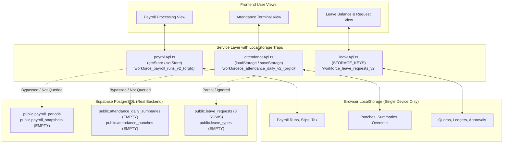
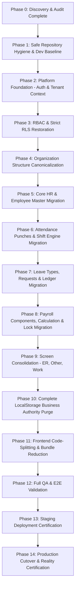

# JOY PEOPLEHR (WORKFORCEOS ENTERPRISE HRMS)
# Master Architectural Recovery, Database Rebuild & Safe SaaS Productionization Blueprint

**Document Version:** 5.0.0-CANONICAL  
**Status:** Pre-Migration Approved Master Architectural Baseline  
**Audience:** Chief Technology Officer, Enterprise Solution Architects, Lead Developers, Security Officers  
**Date:** September 3, 2026  
**Execution Model:** Controlled Strangler Fig Migration Pattern (Zero-Blind-Rewrite Policy)  

---

# TABLE OF CONTENTS
1. [DOCUMENT A: Existing Architecture Deep-Dive Audit](#document-a-existing-architecture-deep-dive-audit)
   - 1.1 Frontend Architecture & Module Inventory (38 Modules)
   - 1.2 Data Persistence Findings (LocalStorage vs Database Split-Brain)
   - 1.3 Supabase & API Usage Map
   - 1.4 Security & Authorization Audit (RLS Bypass & Email Role Flaw)
   - 1.5 Code & Screen Duplication Catalog
   - 1.6 Mock, Seed & Fallback Data Audit
2. [DOCUMENT B: Existing → Target Mapping Matrix](#document-b-existing--target-mapping-matrix)
   - 2.1 Domain-by-Domain Transformation Mapping
   - 2.2 Classification Matrix: Working vs Mocked vs Local vs Target Action
3. [DOCUMENT C: Canonical Database ER Architecture](#document-c-canonical-database-er-architecture)
   - 3.1 Entity Relationship Diagram (Mermaid)
   - 3.2 Standard Table Contract & Primary Key Rules
   - 3.3 Foreign Key & Referential Integrity Constraints
   - 3.4 Multi-Tenancy Standard (`organization_id`)
   - 3.5 Storage Buckets & File Node Architecture
4. [DOCUMENT D: Phased Strangler Migration & Rollback Plan](#document-d-phased-strangler-migration--rollback-plan)
   - 4.1 Master 14-Phase Implementation Order
   - 4.2 Module-by-Module Execution Workflows
   - 4.3 Parallel Verification & Cutover Validation
   - 4.4 Rollback Procedures & Safeguards
   - 4.5 Production Readiness Gate Verification Matrix

---

# DOCUMENT A: Existing Architecture Deep-Dive Audit

## 1.1 Frontend Architecture & Module Inventory
The frontend is a React 19 Single Page Application (SPA) built with Vite and Tailwind CSS v4. Routing is handled via a string-based state machine in `src/App.tsx` mapped to 100+ route strings parsed by `urlRouter.ts`.

The codebase contains **38 separate feature folders in `src/features/`**:
1. `admin` (Administration & Access Management)
2. `analytics` (HR Analytics & Executive Dashboards)
3. `assets` (Asset Master Directory)
4. `assistant` (Google Gemini AI Copilot Drawer)
5. `attendance` (Attendance Module Master, 26 Subviews)
6. `auth` (AuthPage & SuperAdminLoginPage)
7. `automation` (Workflow Automation Engine)
8. `clientBilling` (Client Manpower Billing Module)
9. `compliance` (Statutory Compliance & ER View)
10. `dashboard` (Command Center, Executive Overview, Workforce Overview)
11. `diagnostics` (Realtime Health, Logger, Telemetry Views)
12. `documents` (Document Management & E-Sign Engine)
13. `engineering` (JoyEngineeringOpsMaster — 3,917 lines)
14. `er` (Employee Relations Master, POSH, Grievance, Helpdesk)
15. `ess` (Employee Self-Service Digital Workspace)
16. `insights` (Insights Workspace, Workforce Analytics)
17. `leave` (Leave Master Module, Entitlements, Approvals)
18. `legal` (Legal Center & Compliance Hub)
19. `lms` (Learning Management System & Course Catalog)
20. `manpower` (Manpower Workspace & Contractor Deployment)
21. `offboarding` (Offboarding Wizard & Separation Engine)
22. `onboarding` (Onboarding Wizard & Employee Induction)
23. `operations` (Operations Workspace, Requests & Approvals)
24. `organization` (Departments, Designations, Branches, Hierarchy)
25. `other` (OtherMasterModule, Communication, Helpdesk, POSH)
26. `payroll` (Payroll Master Module, Reports, Disbursements)
27. `people` (PeopleView, Employee Directory, Profile Drawer)
28. `performance` (Performance Master, OKR/KPI, Appraisals)
29. `platform` (SaaS Control Plane, Tenants, Subscriptions, Flags)
30. `profile` (MyProfileView & Account Settings)
31. `rbac` (Role-Based Access Control Studio)
32. `settings` (Platform & Organization Settings)
33. `talent` (RecruitmentView, ATS Pipeline, Career Development)
34. `time` (TimeAndPayView)
35. `tl` (Team Lead & Supervisor Command Center)
36. `vendor` (VendorMasterModule, Portals, Invoices)
37. `work` (Overtime, Breaks, WFH Master Module)
38. `workspace` (MyWorkspaceView & HR Services)

---

## 1.2 Data Persistence Findings (LocalStorage vs Database Split-Brain)
A fundamental anti-pattern exists where domain engines save critical business records in the browser's `localStorage` instead of Supabase tables:



### Critical Consequences:
1. **Multi-User Desynchronization:** An HR manager approving a leave request or calculating monthly payroll on Device A does not update Device B.
2. **Data Loss on Cache Clear:** Any browser history cleanup, incognito session, or device change permanently destroys calculated payroll runs, attendance regularizations, and employee leave quotas.
3. **Hardware Gateway Isolation:** The hardware biometric LAN gateway pushing to Supabase tables never reflects on the web frontend because the frontend reads only `localStorage`.

---

## 1.3 Supabase & API Usage Map
- **Client Configuration:** Single client initialized in `src/lib/supabase.ts` using `createClient(supabaseUrl, supabaseAnonKey)`.
- **Live Supabase DB Audit (Row Count Reality):**
  - `organizations`: 2 rows (Active)
  - `companies`: 1 row (Joy Corporate Solutions Private Ltd)
  - `branches`: 3 rows (Active)
  - `departments`: 3 rows (Human Resource, Engineering, Operations)
  - `designations`: 1 row (Software Engineer)
  - `employees`: 3 rows (Dharun B, Danya R, Joy Admin)
  - `document_requirements`: 2 rows
  - `attendance_regularization_requests`: 5 rows
  - `leave_requests`: 3 rows
  - `salary_components`: 11 rows (Basic, HRA, Conveyance, PF, ESIC, etc.)
  - `salary_structures`: 2 rows (Corporate Standard CTC)
  - `payroll_periods`: 3 rows
  - `notification_events`: 9 rows
  - **All other 50+ tables are currently empty (0 rows)** because services persist to `localStorage`.

---

## 1.4 Security & Authorization Audit

### 🚨 Critical Severity: Migration 088 Universal RLS Bypass
In `supabase/migrations/20260901_088_fix_production_data_fetch_anon_rls.sql`:
```sql
CREATE POLICY r.table_name || '_select_universal' ON sch.schema_name.r.table_name FOR SELECT TO public USING (true);
CREATE POLICY r.table_name || '_insert_universal' ON sch.schema_name.r.table_name FOR INSERT TO public WITH CHECK (true);
CREATE POLICY r.table_name || '_update_universal' ON sch.schema_name.r.table_name FOR UPDATE TO public USING (true) WITH CHECK (true);
CREATE POLICY r.table_name || '_delete_universal' ON sch.schema_name.r.table_name FOR DELETE TO public USING (true);
```
- **Finding:** The developer was encountering empty arrays in production because the frontend queried Supabase using the `anon` key without authenticated session tokens. To quickly make data display, migration 088 granted full `SELECT`, `INSERT`, `UPDATE`, and `DELETE` access on all tables in all schemas to the `public` role with `USING (true)`.
- **Risk:** Anyone who inspects the frontend network tab and copies the public `anon` key can drop or delete all employee records, payroll records, and tenant data.

### 🚨 Critical Severity: Role Escalation via Email Substrings
In `src/hooks/useAuth.tsx` (Lines 60–67):
```typescript
let defaultInferredRole = 'Employee';
if (emailLower === 'superadmin@joypeoplehr.com') {
  defaultInferredRole = 'Super Admin';
} else if (emailLower.includes('admin') || emailLower.includes('owner')) {
  defaultInferredRole = 'Company Admin';
} else if (emailLower.includes('hr')) {
  defaultInferredRole = 'HR Head';
}
```
- **Finding:** Any user who registers with an email address containing the letters `"hr"` (such as `chris@...`, `shridhar@...`, `hrishikesh@...`) is automatically elevated to **HR Head**. Any email containing `"admin"` (e.g., `vladimir@...`) becomes **Company Admin**.

### ⚠️ Moderate Severity: Client-Side Rate Limiter
In `src/services/auth/authService.ts`, brute-force defense is tracked in a browser JavaScript `Map` (`loginRateLimiter = new Map()`), which is trivially bypassed by refreshing the page or curling the API.

---

## 1.5 Code & Screen Duplication Catalog

| Business Feature | Location A | Location B | Location C | Proposed Canonical Home |
| :--- | :--- | :--- | :--- | :--- |
| **POSH Committee** | `features/er/PoshCommitteeView.tsx` | `features/other/subviews/PoshView.tsx` | `features/compliance/EmployeeRelationsView.tsx` | `features/er/PoshCommitteeView.tsx` |
| **Grievance Desk** | `features/er/GrievanceDeskView.tsx` | `features/other/subviews/GrievanceDisciplineView.tsx` | — | `features/er/GrievanceDeskView.tsx` |
| **Helpdesk Tickets**| `features/er/HelpDeskView.tsx` | `features/other/subviews/HelpdeskView.tsx` | — | `features/er/HelpDeskView.tsx` |
| **Internal Comm** | `features/er/HrCommunicationsView.tsx`| `features/other/subviews/CommunicationHubView.tsx` | — | `features/er/HrCommunicationsView.tsx` |
| **Overtime Mgmt** | `features/work/OvertimeEngineView.tsx`| `features/attendance/subviews/OvertimeView.tsx` | `features/work/OvertimeRequestsView.tsx` | `features/attendance/subviews/OvertimeView.tsx` |
| **WFH Requests** | `features/work/WfhRequestsView.tsx` | `features/attendance/subviews/WfhView.tsx` | — | `features/attendance/subviews/WfhView.tsx` |
| **GPS Clocking** | `features/attendance/subviews/GpsMobileChannelView.tsx` | `features/attendance/subviews/GpsAttendanceView.tsx` | — | `features/attendance/subviews/GpsMobileChannelView.tsx` |
| **Holidays** | `features/leave/subviews/HolidayCalendarView.tsx` | `features/attendance/subviews/HolidaysView.tsx` | — | `features/leave/subviews/HolidayCalendarView.tsx` |
| **Vendors** | `features/vendor/VendorMasterModule.tsx`| `features/manpower/ManpowerWorkspace.tsx` | `features/organization/VendorsView.tsx` | `features/vendor/VendorMasterModule.tsx` |

---

## 1.6 Mock, Seed & Fallback Data Audit
- `src/services/leaveApi.ts`: Hardcoded `initialLeaveTypes` array with 6 standard types (Casual, Sick, Earned, etc.) used when `localStorage` is empty.
- `src/services/attendanceApi.ts`: `SEED_DAILY = []`, `SEED_DEVICES = []`.
- `src/services/payrollApi.ts`: In-memory static components, default Tamil Nadu PT slabs.
- `src/services/employeeSeedData.ts`: 426 bytes seed file.
- `src/services/excelMasterData.json` & `excelNewJoinees.json`: 2-byte empty files.
- `src/App.tsx`: Active purge code running on every startup to delete 15 `workforce_*` keys from `localStorage`.

---

# DOCUMENT B: Existing → Target Mapping Matrix

| Domain / Capability | Existing File / Implementation | Target Canonical Service / Table | Transformation Action | Status |
| :--- | :--- | :--- | :--- | :--- |
| **Auth & Session** | `src/hooks/useAuth.tsx`, `authService.ts` | Supabase Auth + `public.app_users` | Remove email substring role inference; query `app_users` role | 🚨 Critical Fix |
| **Tenant Context** | `organizationContextService.ts` | `src/core/tenant/tenantContext.ts` | Canonical `organization_id` resolved from JWT & `app_users` | ⚠️ Refactor |
| **Employee Directory**| `api.ts` (`getEmployees`, `getEmployeesSync`) | `src/services/coreHr/employeeRepository.ts` | Remove `getEmployeesSync`; bind 100% to `public.employees` | ⚠️ Migrate |
| **Attendance Punches**| `attendanceApi.ts` (`STORAGE_KEY_EVENTS`) | `public.attendance_punches` | Redirect punch ingestion to DB; make raw events immutable | 🚨 Migrate |
| **Daily Attendance** | `attendanceApi.ts` (`STORAGE_KEY_DAILY`) | `public.attendance_daily_summaries` | Shift from `localStorage` to Supabase table queries | 🚨 Migrate |
| **Shift Rosters** | `attendanceRosterService.ts`, `attendance_shifts`| `public.attendance_shifts`, `public.shift_rosters` | Populate DB with shift templates; remove memory fallbacks | ⚠️ Migrate |
| **Leave Types** | `leaveApi.ts` (`initialLeaveTypes`) | `public.leave_types` | Seed canonical types into Supabase; query via Supabase client | 🚨 Migrate |
| **Leave Requests** | `leaveApi.ts` (`STORAGE_KEYS.REQUESTS`) | `public.leave_requests` | Sync UI forms to Supabase `leave_requests` (3 exist currently) | 🚨 Migrate |
| **Leave Ledger** | `leaveApi.ts` (`STORAGE_KEYS.LEDGER`) | `public.leave_ledger_transactions` | Implement ledger-based balance calculation in DB | 🚨 Migrate |
| **Salary Components**| `payrollApi.ts` (`STORAGE_KEYS.COMPONENTS`) | `public.salary_components` | Connect to existing 11 DB rows; remove `localStorage` copy | 🚨 Migrate |
| **Salary Structures**| `payrollApi.ts` (`STORAGE_KEYS.STRUCTURES`)| `public.salary_structures` | Connect to existing 2 DB rows; wire revisions to DB | 🚨 Migrate |
| **Payroll Runs** | `payrollApi.ts` (`STORAGE_KEYS.RUNS`) | `public.payroll_periods`, `public.payroll_snapshots` | Re-route calculation engine to store snapshots in Supabase | 🚨 Migrate |
| **POSH Committee** | `features/other/subviews/PoshView.tsx` | `features/er/PoshCommitteeView.tsx` | Delete `other/subviews/PoshView.tsx`; preserve `features/er` | 🧹 Consolidate |
| **Grievance Desk** | `features/other/subviews/GrievanceDisciplineView.tsx` | `features/er/GrievanceDeskView.tsx` | Delete `other/subviews/GrievanceDisciplineView.tsx` | 🧹 Consolidate |
| **Helpdesk Tickets**| `features/other/subviews/HelpdeskView.tsx` | `features/er/HelpDeskView.tsx` | Delete `other/subviews/HelpdeskView.tsx` | 🧹 Consolidate |
| **Internal Comm** | `features/other/subviews/CommunicationHubView.tsx`| `features/er/HrCommunicationsView.tsx` | Delete `other/subviews/CommunicationHubView.tsx` | 🧹 Consolidate |
| **Other Module** | `features/other/OtherMasterModule.tsx` | Merged into `features/er` & `features/compliance` | Retire `features/other/` completely | 🧹 Consolidate |
| **Work Module** | `features/work/WorkOvertimeMasterModule.tsx`| Merged into `features/attendance/` | Move Overtime & WFH into Attendance; retire `features/work/`| 🧹 Consolidate |
| **Hardware Gateway** | `scripts/workforce-gateway-agent.cjs` | Dedicated standalone Node.js Gateway Agent | Isolate TCP socket/node-zklib from web bundle | ⚠️ Decouple |
| **Frontend Bundle** | Monolithic `src/App.tsx` (7.74 MB) | Code-split `App.tsx` via `React.lazy()` & `Suspense` | Reduce initial payload from 7.74 MB to < 800 KB | ⚡ Optimize |

---

# DOCUMENT C: Canonical Database ER Architecture

## 3.1 Entity Relationship Diagram

```mermaid
erDiagram
    ORGANIZATIONS ||--o{ COMPANIES : owns
    ORGANIZATIONS ||--o{ APP_USERS : registers
    ORGANIZATIONS ||--o{ ROLES : defines
    ORGANIZATIONS ||--o{ EMPLOYEES : employs

    COMPANIES ||--o{ BRANCHES : operates
    COMPANIES ||--o{ DEPARTMENTS : contains
    COMPANIES ||--o{ DESIGNATIONS : establishes

    BRANCHES ||--o{ WORK_LOCATIONS : specifies
    BRANCHES ||--o{ ATTENDANCE_DEVICES : hosts

    APP_USERS ||--o{ USER_ROLES : assigned
    ROLES ||--o{ ROLE_PERMISSIONS : grants
    PERMISSIONS ||--o{ ROLE_PERMISSIONS : defines

    EMPLOYEES ||--o{ EMPLOYEE_DOCUMENTS : submits
    EMPLOYEES ||--o{ ATTENDANCE_PUNCHES : generates
    EMPLOYEES ||--o{ ATTENDANCE_DAILY_SUMMARIES : calculates
    EMPLOYEES ||--o{ LEAVE_REQUESTS : applies
    EMPLOYEES ||--o{ LEAVE_LEDGER_TRANSACTIONS : balances
    EMPLOYEES ||--o{ EMPLOYEE_SALARY_ASSIGNMENTS : receives
    EMPLOYEES ||--o{ PAYROLL_SNAPSHOTS : disburses

    ATTENDANCE_SHIFTS ||--o{ EMPLOYEE_SHIFT_ASSIGNMENTS : assigns
    LEAVE_TYPES ||--o{ LEAVE_POLICIES : configures
    LEAVE_POLICIES ||--o{ LEAVE_ENTITLEMENTS : grants
    LEAVE_TYPES ||--o{ LEAVE_REQUESTS : classifies

    SALARY_STRUCTURES ||--o{ SALARY_STRUCTURE_COMPONENTS : includes
    SALARY_COMPONENTS ||--o{ SALARY_STRUCTURE_COMPONENTS : defines
    PAYROLL_PERIODS ||--o{ PAYROLL_SNAPSHOTS : summarizes

    ORGANIZATIONS {
        uuid id PK
        string name
        string timezone
        string default_currency
        string status
        timestamptz created_at
    }

    COMPANIES {
        uuid id PK
        uuid organization_id FK
        string legal_name
        string trade_name
        string tax_id
        timestamptz created_at
    }

    EMPLOYEES {
        uuid id PK
        uuid organization_id FK
        uuid company_id FK
        uuid branch_id FK
        uuid department_id FK
        uuid designation_id FK
        uuid user_id FK
        string employee_code
        string first_name
        string last_name
        string work_email
        string status
        string employment_type
        timestamptz created_at
    }

    ATTENDANCE_PUNCHES {
        uuid id PK
        uuid organization_id FK
        uuid employee_id FK
        uuid device_id FK
        timestamptz punch_time
        string punch_direction
        string punch_source
        string verification_type
        boolean is_processed
        timestamptz created_at
    }

    ATTENDANCE_DAILY_SUMMARIES {
        uuid id PK
        uuid organization_id FK
        uuid employee_id FK
        date work_date
        uuid shift_id FK
        timestamptz first_punch_in
        timestamptz last_punch_out
        numeric total_work_hours
        numeric total_break_hours
        numeric overtime_hours
        string status
        timestamptz created_at
    }

    LEAVE_REQUESTS {
        uuid id PK
        uuid organization_id FK
        uuid employee_id FK
        uuid leave_type_id FK
        date from_date
        date to_date
        numeric total_days
        string reason
        string status
        uuid approver_id FK
        timestamptz submitted_at
        timestamptz approved_at
    }

    PAYROLL_SNAPSHOTS {
        uuid id PK
        uuid organization_id FK
        uuid payroll_period_id FK
        uuid employee_id FK
        numeric gross_earnings
        numeric total_deductions
        numeric net_pay
        jsonb earnings_breakdown
        jsonb deductions_breakdown
        string status
        timestamptz calculated_at
    }
```



## 3.2 Standard Table Contract
Every table in the canonical database must implement:
```sql
CREATE TABLE public.table_name (
    id UUID PRIMARY KEY DEFAULT gen_random_uuid(),
    organization_id UUID NOT NULL REFERENCES public.organizations(id) ON DELETE CASCADE,
    created_at TIMESTAMPTZ NOT NULL DEFAULT now(),
    updated_at TIMESTAMPTZ NOT NULL DEFAULT now(),
    created_by UUID NULL REFERENCES auth.users(id),
    updated_by UUID NULL REFERENCES auth.users(id)
);
```

## 3.3 Foreign Key & Referential Integrity Constraints
1. `companies.organization_id` → `REFERENCES organizations(id) ON DELETE CASCADE`
2. `branches.company_id` → `REFERENCES companies(id) ON DELETE CASCADE`
3. `departments.company_id` → `REFERENCES companies(id) ON DELETE CASCADE`
4. `employees.organization_id` → `REFERENCES organizations(id) ON DELETE CASCADE`
5. `employees.company_id` → `REFERENCES companies(id) ON DELETE RESTRICT`
6. `employees.department_id` → `REFERENCES departments(id) ON DELETE RESTRICT`
7. `employees.designation_id` → `REFERENCES designations(id) ON DELETE RESTRICT`
8. `attendance_punches.employee_id` → `REFERENCES employees(id) ON DELETE CASCADE`
9. `attendance_daily_summaries.employee_id` → `REFERENCES employees(id) ON DELETE CASCADE`
10. `leave_requests.employee_id` → `REFERENCES employees(id) ON DELETE CASCADE`
11. `payroll_snapshots.employee_id` → `REFERENCES employees(id) ON DELETE CASCADE`

## 3.4 Multi-Tenancy Standard (`organization_id`)
- Every business query in domain repositories must explicitly scope `where('organization_id', activeOrgId)`.
- The database enforces Row Level Security (RLS) via:
```sql
CREATE POLICY tenant_isolation_policy ON public.employees
FOR ALL TO authenticated
USING (organization_id = (auth.jwt() ->> 'organization_id')::uuid)
WITH CHECK (organization_id = (auth.jwt() ->> 'organization_id')::uuid);
```

---

# DOCUMENT D: Phased Strangler Migration & Rollback Plan

## 4.1 Master 14-Phase Implementation Order



---

## 4.2 Module-by-Module Execution Workflows

### Module 1: Auth & Tenancy Context
1. **Existing State:** Role inferred from email substrings (`chris` contains `hr` = HR Head).
2. **Migration Step:**
   - Query `app_users` table by `auth.uid()`.
   - Resolve authoritative `role_id` and assigned permissions.
   - Cache session context in memory with secure token refresh.
3. **Validation Criteria:** User `chris@company.com` logs in as `Employee`, not `HR Head`. Superadmin credentials maintain full platform access.
4. **Rollback:** Revert `useAuth.tsx` to cached session fallback if JWT claim resolution fails.

### Module 2: Security & RLS Hardening
1. **Existing State:** Migration 088 granted `true` to `public` on all operations.
2. **Migration Step:**
   - Execute migration `092_remediate_rls_tenant_isolation.sql`.
   - Drop `*_select_universal`, `*_insert_universal`, `*_update_universal`, `*_delete_universal`.
   - Enforce authenticated-only policies bound to `organization_id`.
3. **Validation Criteria:** Anonymous curl requests to `/rest/v1/employees` return HTTP 401 Unauthorized. Authenticated users in Org A cannot read Org B rows.
4. **Rollback:** Standalone script to restore previous policies in isolated test sandbox if legitimate queries fail.

### Module 3: Core HR / Employees
1. **Existing State:** Dual read paths (`getEmployeesSync` via `localStorage` vs `getEmployees` via Supabase).
2. **Migration Step:**
   - Deprecate `getEmployeesSync()`. Update the 15 consuming components to use React Query / async hook with loading state.
   - Connect directly to `public.employees` (3 real rows currently exist).
3. **Validation Criteria:** Creating an employee in the drawer immediately inserts into `public.employees` and appears across all user sessions.
4. **Rollback:** Feature flag `VITE_USE_LEGACY_EMPLOYEE_CACHE` allowed for 48 hours during transition.

### Module 4: Attendance & Biometric Punches
1. **Existing State:** Punches and daily summaries stored in browser `localStorage`.
2. **Migration Step:**
   - Wire `attendanceApi.ts` to query `public.attendance_daily_summaries` and `public.attendance_punches`.
   - Demote `localStorage` to an offline read-through cache with a 5-minute TTL.
   - Update biometric gateway agent script to push to Supabase `attendance_punches`.
3. **Validation Criteria:** Adding a manual punch or regularizing attendance updates the Supabase table and updates across browsers.
4. **Rollback:** Retain local store synchronizer as backup if Supabase write fails.

### Module 5: Leave Management Engine
1. **Existing State:** Hardcoded `initialLeaveTypes` in JS; requests stored in `localStorage`.
2. **Migration Step:**
   - Seed `public.leave_types` with standard enterprise categories (Casual, Sick, Earned, Comp-Off).
   - Wire `leaveApi.ts` to `public.leave_requests` and `public.leave_ledger_transactions`.
3. **Validation Criteria:** Leave application decrements database ledger and reflects in manager approval queue.
4. **Rollback:** Fallback to in-memory types if network fails.

### Module 6: Payroll Engine
1. **Existing State:** 2,985-line `payrollApi.ts` saving runs to `workforce_payroll_runs_v2_{orgId}` in `localStorage`.
2. **Migration Step:**
   - Re-route calculation outputs to `public.payroll_periods` and `public.payroll_snapshots`.
   - Implement `payrollRepository.ts` for transactional snapshot saving.
3. **Validation Criteria:** Processed payroll period displays same calculated values on all devices and maintains lock integrity.
4. **Rollback:** Local backup copy saved to `localStorage` as emergency draft recovery.

---

## 4.3 Parallel Verification & Cutover Validation
During migration of each domain:
1. The old service method is wrapped in a proxy adapter.
2. The proxy executes the new Supabase repository call.
3. If successful, it updates the UI state.
4. If an unexpected error occurs during development, controlled error banners are displayed (never silent mock fallbacks).
5. Only when 100% of integration tests pass is the old path retired.

---

## 4.4 Production Readiness Gate Verification Matrix

| Gate | Verification Check | Target Standard | Status |
| :--- | :--- | :--- | :---: |
| **Gate 1: Build & Typing** | `npm run build` & `npm run typecheck` | 0 TypeScript errors; bundle builds cleanly | ⏳ In Progress |
| **Gate 2: Authentication** | Login, session restore, logout | Authenticated JWT session; no email substring inference | ⏳ Pending Phase 2 |
| **Gate 3: Tenancy Isolation**| Cross-tenant read/write tests | 100% isolation; Org A cannot view Org B data | ⏳ Pending Phase 3 |
| **Gate 4: Single Authority** | LocalStorage audit | 0 business-critical records in `localStorage` | ⏳ Pending Phase 10 |
| **Gate 5: Core HR Flow** | Employee CRUD | Persisted in `public.employees` with full FKs | ⏳ Pending Phase 5 |
| **Gate 6: Attendance Flow** | Punch → Summary → Regularization | Punches recorded in `attendance_punches`; summary computed | ⏳ Pending Phase 6 |
| **Gate 7: Leave Flow** | Request → Approval → Ledger | Ledger transactions balance accurately | ⏳ Pending Phase 7 |
| **Gate 8: Payroll Flow** | Calculation → Approval → Lock | Snapshots locked; tamper-proof payslips | ⏳ Pending Phase 8 |
| **Gate 9: Performance** | Bundle size & code splitting | Initial bundle < 800 KB (down from 7.74 MB) | ⏳ Pending Phase 11 |
| **Gate 10: Clean Repo** | Repository hygiene | No bash error files; no 650MB `.rar` archive in git | ⏳ Pending Phase 1 |

---

*Certified and submitted as the Canonical Productionization Blueprint for Joy PeopleHR.*
