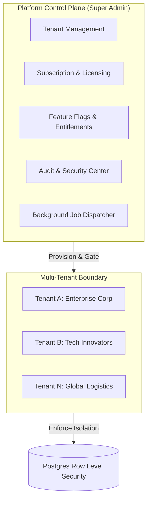
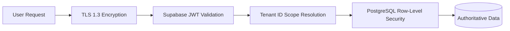
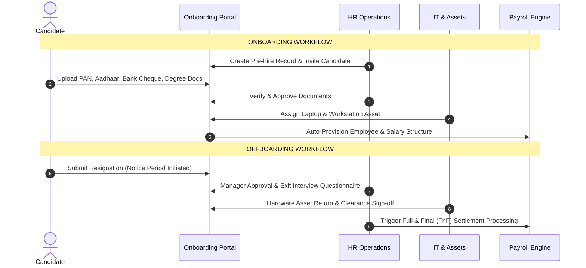
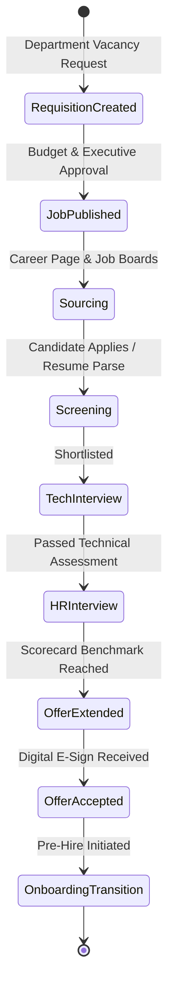
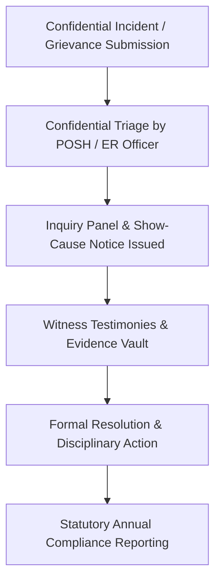
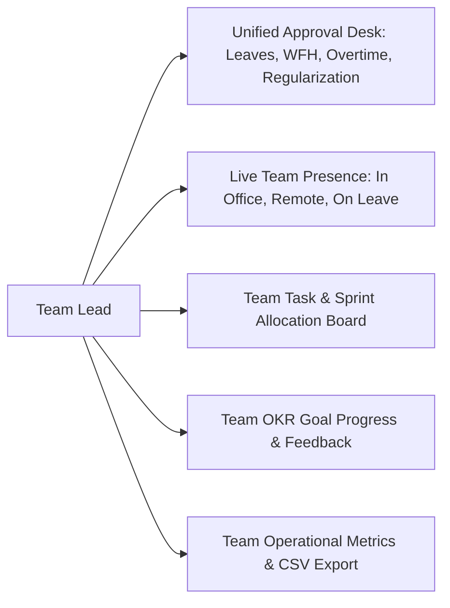
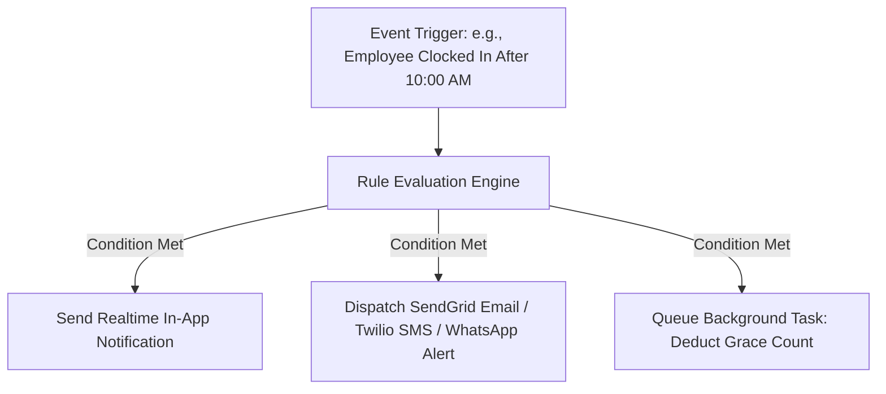
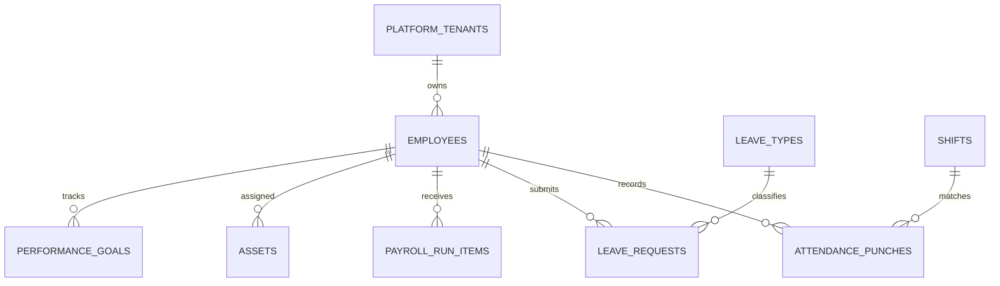

# JOY PEOPLEHR (WORKFORCEOS ENTERPRISE HRMS)
## Master Platform Architectural & Operational Specification Report
**Document Version:** 4.0.0-PROD  
**Target Platform:** Joy PeopleHR (WorkforceOS) Multi-Tenant Enterprise HRMS  
**Audience:** Chief Technology Officer, Enterprise Solution Architects, Lead Developers, HR Executives, Compliance Auditors  
**Date:** August 2026  

---

# TABLE OF CONTENTS
1. [Executive Summary & Product Vision](#1-executive-summary--product-vision)
2. [SaaS Multi-Tenant Architecture & Control Plane](#2-saas-multi-tenant-architecture--control-plane)
3. [Security, Authentication & Role-Based Access Control (RBAC)](#3-security-authentication--role-based-access-control-rbac)
4. [Module 1: Core HR, Organization & Employee Master Directory](#4-module-1-core-hr-organization--employee-master-directory)
5. [Module 2: Enterprise Onboarding & Offboarding Lifecycle Engine](#5-module-2-enterprise-onboarding--offboarding-lifecycle-engine)
6. [Module 3: Enterprise Attendance, Shift Rosters & Biometric Gateway](#6-module-3-enterprise-attendance-shift-rosters--biometric-gateway)
7. [Module 4: Enterprise Leave Master & Accrual Engine](#7-module-4-enterprise-leave-master--accrual-engine)
8. [Module 5: Indian Statutory Payroll & Calculation Engine](#8-module-5-indian-statutory-payroll--calculation-engine)
9. [Module 6: Talent Acquisition & ATS Recruitment Pipeline](#9-module-6-talent-acquisition--ats-recruitment-pipeline)
10. [Module 7: Performance Management, OKR/KPI & 360° Appraisals](#10-module-7-performance-management-okrkpi--360-appraisals)
11. [Module 8: Learning Management System (LMS) & Training Engine](#11-module-8-learning-management-system-lms--training-engine)
12. [Module 9: Employee Relations, POSH & Statutory Compliance](#12-module-9-employee-relations-posh--statutory-compliance)
13. [Module 10: Employee Self-Service (ESS) & Digital Workspace](#13-module-10-employee-self-service-ess--digital-workspace)
14. [Module 11: Team Lead & Supervisor Command Center](#14-module-11-team-lead--supervisor-command-center)
15. [Module 12: Executive Analytics, BI & Custom Report Builder](#15-module-12-executive-analytics-bi--custom-report-builder)
16. [Module 13: Automation, Workflow Engine & Event Notification Mesh](#16-module-13-automation-workflow-engine--event-notification-mesh)
17. [Module 14: Google Gemini AI Copilot Integration](#17-module-14-google-gemini-ai-copilot-integration)
18. [Mobile Companion Application: Flutter Architecture & Klarna Experience](#18-mobile-companion-application-flutter-architecture--klarna-experience)
19. [Database Schema, Migrations & Real-Time Outbox Mesh](#19-database-schema-migrations--real-time-outbox-mesh)
20. [Production Infrastructure, Scalability & Disaster Recovery](#20-production-infrastructure-scalability--disaster-recovery)

---

# 1. EXECUTIVE SUMMARY & PRODUCT VISION

**Joy PeopleHR (WorkforceOS)** is a state-of-the-art, hyper-scalable, multi-tenant Human Resource Management System (HRMS) and Workforce Operating System. Engineered to bridge the gap between heavy enterprise resource planning (ERP) suites and intuitive consumer-grade software, WorkforceOS delivers end-to-end human capital lifecycle management.

```
+---------------------------------------------------------------------------------------------------+
|                                   JOY PEOPLEHR WORKFORCEOS                                       |
+---------------------------------------------------------------------------------------------------+
|  [ Web Application: React 19 / Vite / TS ]     |   [ Mobile Application: Flutter / Dart ]         |
|  Tailwind CSS v4 + Radix UI + Motion           |   Klarna-Style Design Tokens + GPS Geofencing    |
+------------------------------------------------+--------------------------------------------------+
|                            ENTERPRISE DOMAIN SERVICES LAYER                                       |
|  Core HR | On/Offboarding | Attendance & Bio | Leave Engine | Payroll Engine | ATS | LMS | Perf |
+---------------------------------------------------------------------------------------------------+
|                                REALTIME EVENT & OUTBOX MESH                                       |
|  Database CDC Triggers | Webhooks | WebSocket Streams | Background Job Queue | In-App Alerts      |
+---------------------------------------------------------------------------------------------------+
|                               PERSISTENCE & SECURITY FOUNDATION                                   |
|  Supabase PostgreSQL 15+ | 69+ Strict Migrations | 100% Tenant RLS | AES-256 Storage Buckets   |
+---------------------------------------------------------------------------------------------------+
```

### Core Value Propositions:
1. **True Multi-Tenancy with Complete Isolation**: Strict database Row-Level Security (RLS) ensuring absolute data isolation across tenant organizations and legal entities.
2. **Indian Statutory Precision**: Out-of-the-box compliance for Provident Fund (EPF/ECR), Employee State Insurance (ESIC), Professional Tax (PT across 28 states), Income Tax (TDS Old vs New Regimes), and Form 16 / Form 12BB generation.
3. **Multi-Channel Presence & Hardware IoT Gateway**: Unified attendance ingestion blending hardware ZKTeco biometric thumb/face clocks, mobile GPS geofenced punching, and web timesheets.
4. **AI-First HR Automation**: Context-aware Google Gemini 2.5 Flash copilot integrated directly into the workspace shell to answer policy questions, calculate balances, and assist decision-makers.
5. **Modern Multi-Platform Experience**: High-performance React 19 desktop portal coupled with an ultra-slick Flutter mobile companion for iOS and Android built with Klarna-inspired micro-interactions.

---

# 2. SAAS MULTI-TENANT ARCHITECTURE & CONTROL PLANE

WorkforceOS operates on a shared-database, separate-schema/tenant-scoped architectural model managed by an administrative **Platform Control Plane** (`src/features/platform/`).



### 2.1 Tenant Provisioning & Lifecycle Management
- **Tenant Entity**: Each organization is assigned a unique `tenant_id` (UUID v4) associated with a root legal entity, domain routing identifier, storage bucket quota, and licensing tier.
- **Automated Provisioning Flow**:
  1. Organization registration initializes tenant entry in `platform_tenants`.
  2. Baseline structural seeds are executed: Default Role Templates (`Super Admin`, `HR Head`, `Manager`, `Employee`), Standard Leave Types (`Casual`, `Sick`, `Earned`), Standard Shift (`General 9-6`), and Chart of Accounts.
  3. Isolated Storage node created in Supabase Storage with dedicated folder path prefix `tenant_{tenant_id}/`.

### 2.2 Tier Entitlements & Feature Gating
The platform enforces hierarchical licensing tiers:
- **Starter Tier**: Core HR, Employee Directory, Simple Attendance, Basic Leave.
- **Growth Tier**: Starter + Shift Rostering, Regularization Desk, Expense Claims, Document E-Sign.
- **Enterprise Tier**: Growth + ZKTeco Hardware Biometrics, Multi-Level Approval Workflows, Indian Statutory Payroll Pipeline, Custom Report Builder, ATS, LMS, POSH Desk.
- **Feature Flag Engine (`FeatureFlagsView.tsx`)**: Granular toggle mechanism permitting canary rollouts, tenant-specific beta features, and kill-switches with zero code redeployments.

### 2.3 System Health, Session Control & Active Killswitches
- **Active Sessions Desk (`ActiveSessionsView.tsx`)**: Real-time heartbeat tracking of active user JWT sessions across web and mobile. Admins can trigger instant single-session termination or organization-wide force logout during security incidents.
- **Background Jobs Engine (`BackgroundJobsView.tsx`)**: Distributed asynchronous queue overseeing payroll batch crunching, leave accrual cron triggers, statutory file generation, and bulk email dispatches with exponential backoff retries.

---

# 3. SECURITY, AUTHENTICATION & ROLE-BASED ACCESS CONTROL (RBAC)

Security in WorkforceOS follows defense-in-depth principles compliant with ISO 27001 and SOC 2 Type II guidelines.



### 3.1 5-Tier Hierarchical Persona Matrix

| Role Archetype | Scope & Capabilities | Primary Target Interfaces |
| :--- | :--- | :--- |
| **Super Admin / Platform Admin** | Global system configuration, tenant lifecycle, billing, system audit logs, global security policies. | `src/features/platform/` |
| **Company Admin / HR Head** | Organization setup, employee records, complete payroll processing, compliance, ATS, performance calibration. | `src/features/admin/`, `payroll/`, `people/` |
| **Department Manager / Team Lead** | Team attendance ledger, leave & WFH approval inbox, shift swap approvals, sprint task allocations, team OKRs. | `src/features/tl/`, `src/features/manager/` |
| **Standard Employee** | Personal profile, geofenced mobile check-in, leave application, payslip PDF download, expense submissions, LMS. | `src/features/ess/`, `src/features/workspace/` |
| **Compliance & POSH Officer** | Confidential inquiry cases, sexual harassment complaints, show-cause notices, statutory filings. | `src/features/compliance/`, `src/features/er/` |

### 3.2 Granular RBAC Permission Syntax
Permissions are evaluated at runtime using the canonical pattern:
$$\text{module} \cdot \text{resource} \cdot \text{action} \quad \text{(e.g., } \texttt{payroll.salary.read\_sensitive}, \ \texttt{attendance.punch.override}\text{)}$$
- **Dynamic Policy Resolver (`hrAuthorizationService.ts`)**: Evaluates role permissions, organizational unit scopes (e.g., `Department == 'Engineering'`), and reporting hierarchy chains before permitting read/write mutations.
- **Immutable 7-Year Audit Trail (`admin-audit`)**: Every create, update, delete, role assignment, and sensitive data view (such as bank accounts or PAN numbers) emits a cryptographically hashed log into `audit_events` with client IP, user agent, and previous/new state diffs.

---

# 4. MODULE 1: CORE HR, ORGANIZATION & EMPLOYEE MASTER DIRECTORY

The Core HR module (`src/features/organization/`, `src/features/people/`) acts as the single source of truth for all workforce structural relationships.

```
+-----------------------------------------------------------------------------------------------+
|                                  ORGANIZATION ARCHITECTURE                                    |
+-----------------------------------------------------------------------------------------------+
|  Holding Entity / Group  -->  Legal Companies  -->  Regional Branches / Locations            |
|                                                     |                                         |
|                                                     +--> Cost Centers                         |
|                                                     +--> Departments & Sub-Teams              |
|                                                     +--> Designations & Job Bands             |
+-----------------------------------------------------------------------------------------------+
```

### 4.1 Structural Hierarchy & Real-Time Org Chart
- **Multi-Entity Model**: Supports multi-company conglomerates operating under a single tenant. Employees can be transferred or cross-assigned between subsidiaries.
- **Interactive Org Chart (`OrganizationView.tsx`)**: High-performance SVG/Canvas tree visualization computing reporting relationships dynamically from `reporting_manager_id` foreign keys, showing direct reports, vacancy counts, and team sizes.

### 4.2 Comprehensive 360° Employee Master Record (`PeopleView.tsx`)
1. **Identity & Demographics**: Name, personal email, official email, date of birth, blood group, emergency contacts with relationship mapping.
2. **Employment Details**: Employee ID code, date of joining, probation duration (30/60/90/180 days), confirmation date, notice period, employment type (*Full-time, Contract, Intern, Consultant*).
3. **Statutory & Banking Vault**: Encrypted bank account number, IFSC code, bank branch name, Permanent Account Number (PAN), Universal Account Number (UAN), PF member ID, and ESIC insurance number.
4. **Compensation Configuration**: CTC package structure, component breakups (Basic, HRA, Special Allowance, Retirals), and tax regime selection (*Old vs. New*).

### 4.3 Hardware & Asset Lifecycle Engine (`AssetsView.tsx`)
- Tracks laptops, monitors, mobile phones, security keyfobs, and office equipment.
- Records serial numbers, purchase dates, warranty expiry, asset condition (*Brand New, Good, Damaged*), and custody assignment history with digital return acknowledgement receipts.

---

# 5. MODULE 2: ENTERPRISE ONBOARDING & OFFBOARDING LIFECYCLE ENGINE

Managing the employee lifecycle from pre-hire documentation through exit full-and-final settlement.



### 5.1 Onboarding Engine (`src/features/onboarding/`)
- **Automated Checklists**: Role-specific task workflows assigned to HR, IT Admin, Line Manager, and the New Hire.
- **Document Collection & Verification**: OCR-ready document capture for national identity cards, previous employment relieving letters, and educational certificates with status flags (*Pending, Under Review, Verified, Rejected*).
- **Auto-Provisioning Bridge**: Once onboarding status transitions to `COMPLETED`, the system triggers an RPC function (`fn_provision_employee_account`) that creates the Supabase Auth identity, binds default leave balances, and generates the initial shift roster.

### 5.2 Offboarding & Separation Engine (`src/features/offboarding/`)
- **Resignation & Notice Period Tracking**: Dynamic calculation of last working day (LWD) based on contractual notice periods and leaves taken during notice.
- **Multi-Department Clearance Matrix**: Step-by-step clearance sign-offs required from *Reporting Manager, IT Assets, Finance/Accounts, Legal, and HR*.
- **Exit Interview Analytics**: Structured feedback capture covering reasons for leaving, company culture ratings, and management effectiveness, feeding directly into Attrition Analytics.

---

# 6. MODULE 3: ENTERPRISE ATTENDANCE, SHIFT ROSTERS & BIOMETRIC GATEWAY

A robust, multi-channel time-tracking and attendance management ecosystem (`src/features/attendance/`).

```
+-----------------------------------------------------------------------------------------------+
|                              MULTI-CHANNEL ATTENDANCE PIPELINE                                |
+-----------------------------------------------------------------------------------------------+
|  [ ZKTeco Biometric Devices ]      [ Mobile GPS Geofencing ]       [ Web Check-In / Remote ]  |
|  IP Push / UDP Gateway Agent       Latitude / Longitude / Radius   IP & Browser Verification  |
+------------------------------------+-------------------------------+--------------------------+
                                     |
                                     v
+-----------------------------------------------------------------------------------------------+
|                            ATTENDANCE INGESTION & DEVIATION ENGINE                            |
|  * Shift Matching (General / Morning / Night)   * Grace Period Evaluation (15 mins)           |
|  * Late Arrival & Early Departure Calculation   * Auto Half-Day & LOP Deduction Triggers      |
+-----------------------------------------------------------------------------------------------+
                                     |
                                     v
+-----------------------------------------------------------------------------------------------+
|                            REGULARIZATION & APPROVAL DESK                                     |
|  * Missed Punch Requests  * On-Duty / Client Visit Regularization  * Overtime Calculation     |
+-----------------------------------------------------------------------------------------------+
```

### 6.1 Hardware Biometric Gateway (ZKTeco Protocol Integration)
- **Node.js Gateway Agent (`scripts/workforce-gateway-agent.cjs`)**: Direct daemon service interfacing with on-premises biometric terminal clocks over UDP/TCP ports 4370.
- **Dual-Way Sync**:
  - **Pull Stream**: Continuously streams device punch logs (User PIN, Timestamp, Verify Mode) into the Supabase `attendance_punches` table.
  - **Push Stream**: Syncs employee roster templates, names, and card IDs to edge devices without local manual entry.

### 6.2 Mobile GPS Geofencing Engine
- Enforces strict mathematical distance checks using the Haversine formula:
  $$d = 2r \arcsin \left( \sqrt{\sin^2\left(\frac{\Delta \phi}{2}\right) + \cos(\phi_1)\cos(\phi_2)\sin^2\left(\frac{\Delta \lambda}{2}\right)} \right)$$
- Rejects simulated or mock GPS locations (`isMock == true`) and enforces horizontal accuracy requirements ($\le 50\text{m}$) within approved radii ($50\text{m} - 200\text{m}$).

### 6.3 Shift Rostering & Shift Swap Engine
- Supports flexible shifts, fixed shifts, rotational day/night shifts, and split shifts.
- **Shift Swapping**: Peer-to-peer shift exchange with automated conflict validation (prevents scheduling shifts within 11 hours of previous shift finish) and manager approval routing.

### 6.4 Regularization & Deviations Engine
- **Late / Early Departure Tracking**: Configurable grace periods (e.g., 15 minutes). Automated penalties: 3 consecutive late arrivals $\rightarrow$ 0.5-day Loss of Pay (LOP) or leave deduction.
- **Missed Punch Regularization**: Employees submit punch correction requests with business reasons and proof documents, routing directly to team leads.

---

# 7. MODULE 4: ENTERPRISE LEAVE MASTER & ACCRUAL ENGINE

The leave engine (`src/features/leave/`, `supabase/migrations/*leave*`) handles complex statutory leave policies, automated accruals, and encashment.

```mermaid
flowchart LR
    subgraph LeaveTypes ["Leave Policy Types"]
        CL[Casual Leave - 12 Days]
        SL[Sick Leave - 12 Days]
        EL[Earned Leave - 15 Days]
        MAT[Maternity - 26 Weeks]
        PAT[Paternity - 15 Days]
        CO[Compensatory Off]
    end

    subgraph AccrualEngine ["Automated Accrual & Processing Engine"]
        MonthlyCron[Monthly Cron Accrual: +1.25 Days/Mo]
        CF[Year-End Carry Forward / Lapse Caps]
        Encash[Leave Encashment Formula]
    end

    subgraph Operations ["Operational Desks"]
        Apply[Employee Application & Sandwich Rule]
        Approve[Sequential Multi-Level Approvals]
        PayrollBridge[Unpaid Leave -> LOP Sync to Payroll]
    end

    LeaveTypes --> AccrualEngine
    AccrualEngine --> Operations
```



### 7.1 Leave Policy Definitions & Entitlements
- **Standard Categories**: Casual Leave (CL), Sick/Medical Leave (SL), Privilege/Earned Leave (PL/EL), Maternity Leave (26 weeks per Indian Maternity Benefit Act), Paternity Leave, Bereavement Leave, and Compensatory Off (Comp-Off).
- **Accrual Rules**: Pro-rata monthly accrual on the 1st of every month (e.g., $1.25\text{ days/month}$ for EL) with probation-period restrictions and max accumulation limits (e.g., cap of 30 or 45 days).

### 7.2 Sandwich Rule & Policy Enforcement Engine
- **Sandwich Rule Enforcement**: If an employee takes leave on Friday and Monday, the intermediate Saturday and Sunday are automatically counted as leave if the sandwich policy flag is active.
- **Notice Period Restrictions**: Automated blocking of privileged leaves during active resignation notice periods unless explicitly overridden by HR Head.

### 7.3 Leave Encashment & Adjustment Ledger
- **Encashment Formula**:
  $$\text{Encashment Payout} = \frac{\text{Monthly Basic Salary}}{30} \times \text{Encashable Earned Leave Units}$$
- Synchronizes encashment units directly into the monthly payroll earnings ledger.

---

# 8. MODULE 5: INDIAN STATUTORY PAYROLL & CALCULATION ENGINE

A 4-step enterprise payroll engine (`src/features/payroll/`, `supabase/payroll_calculation_engine.sql`) compliant with Indian labor laws and tax regulations.

```
+-----------------------------------------------------------------------------------------------+
|                                 4-STEP PAYROLL PROCESSING RUN                                 |
+-----------------------------------------------------------------------------------------------+
|  STEP 1: Attendance & LOP Ingestion    --> Ingests total days, approved leaves, and LOP units |
|  STEP 2: Gross & Deductions Draft Run --> Computes PF, ESI, PT, TDS, and Overtime additions   |
|  STEP 3: HR Review & Variance Audit   --> Compares with previous month's payout variance      |
|  STEP 4: Lock, Bank File & Payslips   --> Generates NEFT/RTGS CSV files and PDF payslips      |
+-----------------------------------------------------------------------------------------------+
```

### 8.1 CTC Salary Component Structuring

$$\begin{aligned}
\text{Gross Salary} &= \text{Basic} + \text{HRA} + \text{Special Allowance} + \text{Conveyance} + \text{Medical} \\
\text{Total Deductions} &= \text{Employee PF} + \text{Employee ESI} + \text{Professional Tax (PT)} + \text{TDS (Tax)} + \text{LOP} \\
\mathbf{\text{Net Take-Home}} &= \mathbf{\text{Gross Salary}} - \mathbf{\text{Total Deductions}}
\end{aligned}$$

| Component | Standard Statutory Calculation Formula |
| :--- | :--- |
| **Basic Salary** | $40\% - 50\%$ of Total CTC Package. |
| **House Rent Allowance (HRA)** | $50\%$ of Basic (Metro cities) or $40\%$ of Basic (Non-metro cities). |
| **Special Allowance** | Balancing figure ensuring aggregate matches gross CTC. |
| **Employee Provident Fund (EPF)** | $12\%$ of Basic (capped at statutory wage ceiling of ₹15,000/mo or on full basic). |
| **Employer Provident Fund (EPS/EPF)** | $3.67\%$ EPF + $8.33\%$ EPS (capped at ₹1,250/mo) + $0.5\%$ EDLI + Admin charges. |
| **Employee State Insurance (ESIC)** | $0.75\%$ Employee + $3.25\%$ Employer (applicable if Gross Salary $\le \text{₹}21,000/\text{mo}$). |
| **Professional Tax (PT)** | State-specific tiered slab (e.g., Karnataka: ₹200/mo if Gross $\ge \text{₹}15,000$; Maharashtra: ₹200-₹300). |
| **Loss of Pay (LOP) Deduction** | $\displaystyle \text{LOP Amount} = \frac{\text{Gross Salary}}{\text{Total Days in Month}} \times \text{Unpaid Absence Days}$ |

### 8.2 Income Tax (TDS) Computation Engine
- Evaluates tax liabilities across both **Old Tax Regime** (with Chapter VI-A deductions: 80C up to ₹1.5L, 80D medical, HRA exemption via Form 12BB) and **New Tax Regime** (Section 115BAC default slab rates with standard deduction of ₹75,000).
- Computes monthly TDS withholding by forecasting annual taxable income and dividing remaining liability across remaining months of the fiscal year.

### 8.3 Digital Payslips, Form 16 & Bank Disbursement Files
- **Bank Payout Sheets**: Auto-generates standard multi-bank NEFT/RTGS batch upload files (HDFC, ICICI, SBI format) with account numbers, IFSC codes, beneficiary names, and exact net salary figures.
- **Password-Protected PDF Payslips**: High-resolution encrypted payslips generated via `pdfjs-dist` with password format (*First 4 letters of name in caps + Date of Birth in DDMM format*).

---

# 9. MODULE 6: TALENT ACQUISITION & ATS RECRUITMENT PIPELINE

An end-to-end Applicant Tracking System (`src/features/talent/`) streamlining hiring workflows.



### 9.1 Job Requisition Workflow
- Multi-level vacancy authorization tracking: *Headcount justification, budget allocation, job description, target hiring manager, and salary band limits*.

### 9.2 Kanban Candidate Pipeline (`RecruitmentView.tsx`)
- Drag-and-drop recruitment stages with real-time candidate progression.
- Structured interview scheduling with calendar integration, candidate email reminders, and role-based evaluation scorecards (*1-5 rating across Technical Skills, Communication, Culture Fit, Problem Solving*).
- Candidate talent pool repository with tag-based resume searching and past applicant rediscovery.

---

# 10. MODULE 7: PERFORMANCE MANAGEMENT, OKR/KPI & 360° APPRAISALS

Continuous goal alignment and appraisal management (`src/features/performance/`).

```
+-----------------------------------------------------------------------------------------------+
|                            STRATEGIC PERFORMANCE HIERARCHY                                    |
+-----------------------------------------------------------------------------------------------+
|  Company Strategic Objectives (e.g., $10M ARR, 99.99% SLA)                                    |
|     |                                                                                         |
|     +--> Department Key Results (KRAs) (e.g., Reduce Attrition to <5%)                        |
|             |                                                                                 |
|             +--> Individual SMART Goals & Measurable KPIs (e.g., Ship 4 Major Features)       |
+-----------------------------------------------------------------------------------------------+
```

### 10.1 OKR & KPI Cascading Framework
- Quantitative goal tracking with milestone deadlines, completion percentages, and automated progress updates linked to completed tasks.

### 10.2 360° Review Cycles & Bell Curve Calibration
- **Review Stages**: Self-Appraisal $\longrightarrow$ Peer Reviews (up to 3 peers) $\longrightarrow$ Direct Manager Evaluation $\longrightarrow$ Department Head Review.
- **Bell Curve Normalization (`performance-ratings`)**: Visual appraisal calibration grid classifying employees across performance tiers (*Top 10% Outstanding, 70% Meets Expectations, 20% Needs Improvement*) to ensure rating distribution integrity across business units.

### 10.3 Performance Improvement Plans (PIP)
- Structured 30/60/90-day remediation plans with weekly milestone check-ins, mentor assignments, and formal exit/retention criteria.

---

# 11. MODULE 8: LEARNING MANAGEMENT SYSTEM (LMS) & TRAINING ENGINE

Corporate training, skill development, and compliance certifications (`src/features/lms/`).

```
+-----------------------------------------------------------------------------------------------+
|                                     ENTERPRISE LMS ENGINE                                     |
+-----------------------------------------------------------------------------------------------+
|  * Course Builder (Video, SCORM, PDF, Slide decks)                                            |
|  * Mandatory Compliance Modules (POSH, InfoSec ISO 27001, Anti-Bribery)                       |
|  * Online Assessment Engine (Timed quizzes, passing grade thresholds, attempt limits)         |
|  * Automated Digital Certificate Generation with unique verification QR codes                 |
|  * Skill Gap Matrices & Career Progression Path Recommenders                                  |
+-----------------------------------------------------------------------------------------------+
```

- **Mandatory Compliance Enforcement**: Automated reminders and escalation alerts to managers for overdue compliance courses.
- **Certification Engine**: Real-time PDF certificate issuance upon successful completion of required assessments.

---

# 12. MODULE 9: EMPLOYEE RELATIONS, POSH & STATUTORY COMPLIANCE

Legal safeguarding, grievance resolution, and workplace integrity (`src/features/compliance/`, `src/features/er/`).



### 12.1 POSH (Prevention of Sexual Harassment) Master Desk
- **Internal Complaints Committee (ICC)**: Configured panel members with designated external NGO advisors in compliance with the Indian POSH Act 2013.
- **Confidential Case Logging**: Encrypted incident reporting with masked identities, evidentiary attachment storage, and statutory 90-day inquiry countdown timers.

### 12.2 Grievance Desk & Disciplinary Actions
- Confidential grievance lodging covering compensation disputes, manager conflicts, and workplace conditions with tracked SLA resolution times.
- Formal show-cause notice generation and disciplinary tracking matrix (*Verbal Warning, Written Warning, Suspension, Termination*).

---

# 13. MODULE 10: EMPLOYEE SELF-SERVICE (ESS) & DIGITAL WORKSPACE

Consumer-quality personal HR portal for everyday staff (`src/features/ess/`, `src/features/workspace/`).

```
+-----------------------------------------------------------------------------------------------+
|                             EMPLOYEE SELF-SERVICE (ESS) CAPABILITIES                          |
+-----------------------------------------------------------------------------------------------+
|  * Smart Home Dashboard with time-based greetings & live punch-in running timer               |
|  * Digital Virtual ID Card with dynamic scannable QR Code for physical turnstile access       |
|  * One-Click Leave & WFH Application modal with instant balance preview                       |
|  * Interactive Payslip Archive with historical salary breakdowns and Form 16 downloads        |
|  * Expense Claim Submission Desk with camera receipt photo compression & status tracker       |
|  * IT Hardware Custody Vault with serial numbers and asset sign-off history                   |
|  * Personal Document Vault (Appointment Letter, Increment Letters, Tax Declarations)          |
+-----------------------------------------------------------------------------------------------+
```

---

# 14. MODULE 11: TEAM LEAD & SUPERVISOR COMMAND CENTER

Empowering team leaders and frontline managers (`src/features/tl/`, `src/features/manager/`).



- **Unified Approval Hub**: Single consolidated inbox eliminating approval bottlenecks. Approvers can review, approve, or reject requests with one click.
- **Real-Time Team Ledger**: Immediate visibility into who is clocked in, working from home, absent, or on client visit.

---

# 15. MODULE 12: EXECUTIVE ANALYTICS, BI & CUSTOM REPORT BUILDER

Strategic workforce intelligence for C-suite and HR leaders (`src/features/analytics/`).

```
+-----------------------------------------------------------------------------------------------+
|                                EXECUTIVE BI & ANALYTICS SUITE                                 |
+-----------------------------------------------------------------------------------------------+
|  [ CEO Executive Overview ]       [ Headcount & Demographics ]    [ Attrition Predictor ]     |
|  Revenue per Employee, Span of    Age distribution, Gender        Voluntary vs Involuntary    |
|  Control, Department Headcounts   Ratio, Tenure Heatmaps          Early-Exit Trend Modeling   |
+-----------------------------------+-------------------------------+---------------------------+
|  [ Finance & Payroll BI ]         [ Attendance & Absenteeism ]    [ Custom Report Builder ]   |
|  Monthly CTC Burn, Overtime Cost, Late arrival cost analysis,     Drag-and-Drop Column Query  |
|  Statutory Liability Breakdowns   Department Absenteeism %        Engine + Excel/PDF Exporter |
+-----------------------------------------------------------------------------------------------+
```

- **Custom Report Builder (`analytics-reports`)**: Interactive query canvas enabling HR admins to pick database fields (*Employee, Designation, Salary, Attendance %, Leave Balance*), apply date/department filters, and export instant CSV or formatted PDF reports.

---

# 16. MODULE 13: AUTOMATION, WORKFLOW ENGINE & EVENT NOTIFICATION MESH

Eliminating manual HR operations through reactive event-driven triggers (`src/features/automation/`).



### Multi-Channel Notification Mesh
- **In-App Notification Stream**: Real-time websocket notification center with read/unread tracking.
- **External Communications Adapters**: Pluggable integrations for SendGrid (Email), Twilio (SMS), Meta WhatsApp Business API, and Slack/MS Teams incoming webhooks.

---

# 17. MODULE 14: GOOGLE GEMINI AI COPILOT INTEGRATION

An integrated generative AI copilot (`src/services/geminiService.ts`, `src/features/assistant/`) powered by the official `@google/genai` SDK and Google AI Studio.

```
+-----------------------------------------------------------------------------------------------+
|                                 GOOGLE GEMINI AI COPILOT PIPELINE                             |
+-----------------------------------------------------------------------------------------------+
|  User Query: "What is my remaining Casual Leave balance and how do I apply for next Monday?"  |
+-----------------------------------------------------------------------------------------------+
                                    |
                                    v
+-----------------------------------------------------------------------------------------------+
|                              CONTEXT-AWARE PROMPT ENRICHMENT                                  |
|  * Injects active user session context (Employee ID, Role, Department)                       |
|  * Injects current leave balances (CL: 3.5 days, SL: 6 days)                                  |
|  * Injects company HR policy guidelines & sandwich rule configuration                         |
+-----------------------------------------------------------------------------------------------+
                                    |
                                    v
+-----------------------------------------------------------------------------------------------+
|                         GEMINI 2.5 FLASH INFERENCE & ACTION STREAM                            |
|  * Delivers conversational, precise policy explanations                                       |
|  * Offers instant action shortcuts (e.g., "Click here to pre-fill leave form for Monday")     |
+-----------------------------------------------------------------------------------------------+
```

- **Offline & Graceful Fallback**: If no API key is supplied, a built-in deterministic heuristic rule engine answers common HR operations seamlessly.

---

# 18. MOBILE COMPANION APPLICATION: FLUTTER ARCHITECTURE & KLARNA EXPERIENCE

A mobile companion application located in `1.FlutterApp/flutter_app/` designed with **Klarna-inspired design aesthetics**.

```
+-----------------------------------------------------------------------------------------------+
|                                 FLUTTER MOBILE ARCHITECTURE                                   |
+-----------------------------------------------------------------------------------------------+
|  Presentation Layer: Klarna Tokens (Pastel Squircles, Emerald Green #07563D, Plus Jakarta Sans)|
|  Floating Bottom Nav -> [ Home | Attendance | Leave | More | Profile ]                        |
+-----------------------------------------------------------------------------------------------+
|  Core Services Layer:                                                                         |
|  * LocationService: Continuous GPS accuracy checks, Geofence evaluation, Spoof detection      |
|  * AttendanceService: Live running ticker, check-in state machine, punch dispatch             |
|  * SupabaseAuthRepository: Realtime JWT session preservation and biometric lock               |
+-----------------------------------------------------------------------------------------------+
|  Hardware & Native Plugins:                                                                   |
|  * geolocator  * image_picker & flutter_image_compress  * pdfx (Payslips)  * photo_view       |
+-----------------------------------------------------------------------------------------------+
```

### Key Mobile Innovations:
1. **Smart Geofence Auto-Prompt**: When an employee physically steps within 100 meters of the company perimeter, the phone detects entry and displays a one-tap check-in prompt.
2. **Offline-Ready Camera Receipt Compression**: Expense receipts snapped on the camera are compressed to $<150\text{ KB}$ on-device before uploading to Supabase Storage.
3. **Encrypted PDF Payslip Viewer**: Native mobile payslip viewing with PIN authorization.

---

# 19. DATABASE SCHEMA, MIGRATIONS & REAL-TIME OUTBOX MESH

The database foundation is built on Supabase PostgreSQL with **69 structured SQL migration files** (`supabase/migrations/`).



### Highlights of Key Migration Batches:
- `20260814_001` to `019`: SaaS control plane, tenant isolation, billing, session management, and background jobs.
- `20260817_020` to `028`: Multi-entity legal companies, departments, vendor master, and onboarding engine.
- `20260818_029` to `041`: Documents e-sign, assets inventory, ATS recruitment, ZKTeco biometric gateway, and shift rosters.
- `20260824_042` to `044`: Enterprise leave master v3, accrual calculation stored procedures.
- `20260825_045` to `056`: Canonical CRUD outbox mesh, GPS geofencing mobile channels, storage buckets, and health mesh.
- `20260826` to `027`: Attendance deviations engine, regularization desks, employee relations hub, and expense proof vaults.

---

# 20. PRODUCTION INFRASTRUCTURE, SCALABILITY & DISASTER RECOVERY

```
+-----------------------------------------------------------------------------------------------+
|                                PRODUCTION INFRASTRUCTURE                                      |
+-----------------------------------------------------------------------------------------------+
|  Cloud Edge CDN (Vercel / Cloudflare)  -->  Vite React 19 Frontend (SPA Static Bundle)        |
|  Mobile Stores (Google Play / App Store) -->  Flutter Android/iOS Native Binaries             |
|  Cloud Backend (Supabase Managed Cloud) -->  PostgreSQL 15+ with Connection Pooling (PgBouncer)|
|  Storage Infrastructure                -->  S3-Compatible Encrypted Object Storage            |
|  Background Compute Workers            -->  Node.js / Go Edge Functions for Cron Jobs         |
+-----------------------------------------------------------------------------------------------+
```

### 20.1 Scalability & Performance Benchmarks
- **Target Response Time**: Sub-100ms API query latency via indexed database keys and connection pooling.
- **High Concurrency Attendance Punch Ingestion**: Capable of ingesting 10,000+ simultaneous biometric and GPS clock-ins per minute during morning shift peaks using PostgreSQL outbox queues.

### 20.2 Disaster Recovery & Business Continuity
- **Automated Point-in-Time Recovery (PITR)**: Database backups every 60 seconds with 30-day retention.
- **Zero-Downtime Migration Strategy**: All SQL schema updates strictly adhere to forward-compatible migrations (adding non-null columns with defaults, blue-green table swaps).

---

## Conclusion & Architectural Sign-Off

The **Joy PeopleHR (WorkforceOS)** platform is a fully realized, enterprise-grade HRMS engineered for high security, strict Indian statutory compliance, delightful user experience, and hyper-scale multi-tenancy. Every module is deeply integrated into an event-driven mesh, providing a reliable workforce backbone for modern enterprises.
