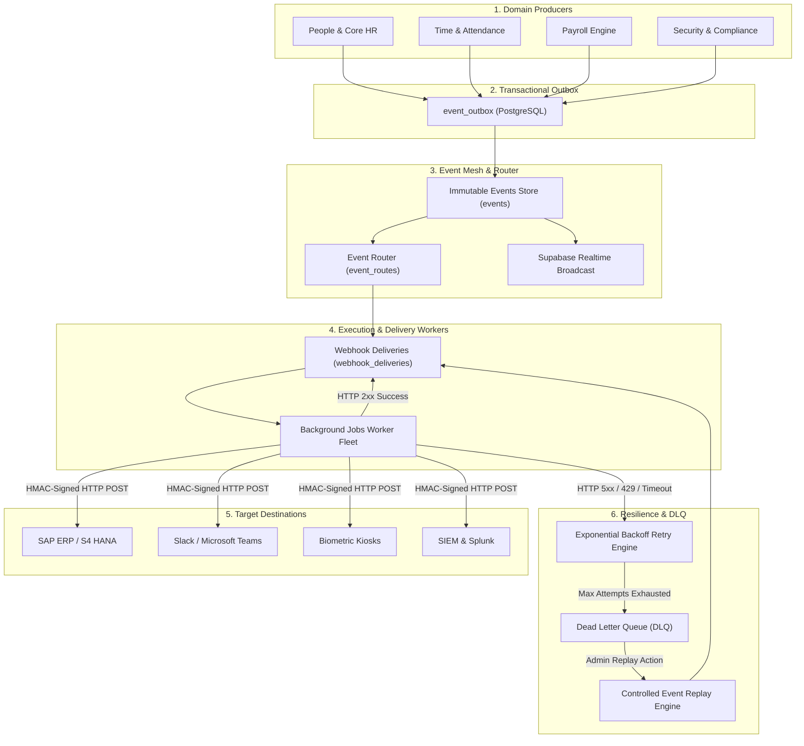

# WorkForceOS Enterprise HRMS — Webhooks & Event Mesh Architecture Report

> **Document Version:** 1.0  
> **Target Audience:** Platform Architects, Super Admins, DevOps, Integration Engineers  
> **Status:** Production Ready (PostgreSQL + Supabase Realtime + Queues)  

---

## 1. Executive Summary

**Webhooks & Event Mesh** is the event-driven communication backbone of WorkForceOS. Whenever an action happens within the HRMS (such as an employee being hired, a punch-in from a biometric kiosk, a payroll run completion, or a subscription change), WorkForceOS publishes an **immutable event** into the Event Mesh. 

The Event Mesh routes these events to:
1. **External Third-Party Endpoints:** SAP S/4HANA, Salesforce, Slack, Workday, SIEM systems (Splunk/Datadog), and client servers.
2. **Internal Distributed Workers:** Asynchronous background processors for payroll statutory calculations, email notifications, audit trails, and AI Copilot analytics.



---

## 2. End-to-End Event Lifecycle

```text
[User / HR Action]
       │
       ▼ (Database Transaction)
[PostgreSQL Table Update + Outbox Insert] ─── (Transactional Outbox guarantees zero lost events)
       │
       ▼ (Event Dispatcher)
[Validate against JSON Schema (Draft-07)]
       │
       ▼
[Save to Immutable 'events' Store]
       │
       ├───────────────────────────────────────────────┐
       ▼                                               ▼
[Evaluate 'event_routes' by Topic/Tenant/Environment] [Supabase Realtime Broadcast to UI]
       │
       ▼
[Generate Idempotent 'webhook_deliveries']
       │
       ▼
[Background Jobs Delivery Worker Claims Job Lease]
       │
       ▼
[Generate HMAC-SHA256 Signature (Payload + Timestamp)]
       │
       ▼
[Send Signed HTTP Request with SSRF & Timeout Protection]
       │
   ┌───┴───────────────────────────────┐
   ▼                                   ▼
[HTTP 2xx (Success)]            [HTTP 4xx / 5xx / Timeout (Failure)]
   │                                   │
   ▼                                   ▼
Mark Delivery SUCCEEDED          Check Retry Policy (Exponential Backoff)
                                       │
                                 ┌─────┴────────────────┐
                                 ▼                      ▼
                          [Attempts < Max]       [Attempts >= Max]
                                 │                      │
                                 ▼                      ▼
                          Schedule Retry          Move to Dead-Letter Queue (DLQ)
                                                        │
                                                        ▼
                                                  Admin Replay Action
```

---

## 3. Key Real-World Enterprise Use Cases

| Domain | Event Type | Target Consumer | Enterprise Value |
| :--- | :--- | :--- | :--- |
| **Enterprise ERP Sync** | `workforce.employee.created`<br>`workforce.employee.updated` | **SAP S/4HANA / Oracle ERP** | Keeps central ERP master synchronized with WorkForceOS employee profiles, salary bands, and cost centers instantly without manual re-entry. |
| **Team Collaboration** | `leave.request.submitted`<br>`workforce.employee.created` | **Slack / Microsoft Teams** | Automatically posts welcome announcements for new joiners, sends leave approval prompts directly into team channels, and alerts managers. |
| **Hardware Biometric Terminals** | `attendance.punch.created` | **Edge Biometric Devices & Turnstiles** | Real-time punch ingestion from physical turnstiles, face-recognition kiosks, and mobile geofenced apps directly into the attendance ledger. |
| **Financial & Accounting** | `payroll.run.completed` | **Banking APIs / Tally / NetSuite** | When payroll is locked, bank transfer batches and general ledger journal vouchers are dispatched automatically. |
| **Security Operations (SecOps)** | `security.alert.triggered` | **Splunk / Datadog / SIEM** | Instantly alerts Security Operations Centers when impossible travel velocity, brute force MFA attempts, or privilege elevations occur. |
| **SaaS Multi-Tenant Billing** | `subscription.plan.updated` | **Stripe / Razorpay / Internal Billing** | Synchronizes seat licenses, tier upgrades, and feature entitlements across the platform. |

---

## 4. Platform Admin Control Capabilities

The **Platform Admin Control Center** gives Super Admins full operational control:

### 1. Multi-Step Webhook Endpoint Management
- **Step 1: Details & Environment Isolation:** Configure target URL, environment (`PRODUCTION` vs `STAGING`), and HTTP timeout (5–10s SLA).
- **Step 2: Zero-Trust Security:** Automatic HMAC-SHA256 signing secret generation, masked storage (`whsec_•••••••38f2`), and IP allowlist enforcement.
- **Step 3: Granular Event Subscriptions:** Subscribe specifically to domain events (`workforce.*`, `attendance.*`, `payroll.*`).
- **Step 4: Delivery & Backoff Policy:** Configure max retry attempts (3 to 10), initial retry delays (5s to 30s), and custom retryable status codes (`408`, `429`, `500`, `502`, `503`, `504`).

### 2. Live Failure Center & Incident Remediation
- **Smart Grouping:** Collapses thousands of delivery errors into aggregate signatures (e.g. `GATEWAY_TIMEOUT`, `SERVICE_UNAVAILABLE`).
- **Bulk Retry:** One-click bulk retry that safely requeues failed jobs with jittered backoff without crashing recipient servers.
- **Support & Audit Links:** Direct one-click navigation from a failing delivery to open support tickets or trace audit trails.

### 3. Dead Letter Queue (DLQ) & Forensics
- Retains events that exhausted all automated retries.
- Displays full forensic attempt logs, HTTP response headers, duration timelines, and error messages.
- Allows admins to **Inspect Payload**, **Replay to Queue**, or **Discard**.

### 4. Real Event Tester & Safe Simulation
- Test webhooks before going live with simulated payloads.
- Generates valid HMAC headers (`X-WorkForceOS-Signature`, `X-WorkForceOS-Timestamp`, `X-WorkForceOS-Event-ID`).
- Validates TLS 1.3 handshakes and measures roundtrip latency.

---

## 5. Security & Isolation Architecture

1. **SSRF Protection Guard:**
   - Server-side validation automatically rejects `localhost`, `127.0.0.1`, RFC1918 private subnets (`10.0.0.0/8`, `172.16.0.0/12`, `192.168.0.0/16`), and cloud metadata (`169.254.169.254`).
2. **Environment Barrier:**
   - `STAGING` events can never be delivered to `PRODUCTION` endpoints.
3. **Tenant Boundary:**
   - Every event carries `tenant_id` and `organization_id` ensuring strict multi-tenant isolation.
4. **Credential Security:**
   - Raw secrets are never stored in plaintext or exposed to browser sessions after initial setup.
5. **Idempotency Guarantee:**
   - Every delivery contains `X-WorkForceOS-Event-ID` and `idempotency_key` allowing downstream consumers to safely deduplicate retried deliveries.
