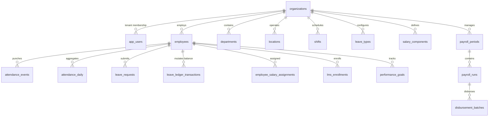

# 02. SCHEMA RELATIONSHIP MAP — ACTUAL DATABASE ARCHITECTURE

**Audit Scope:** Real foreign key dependencies, references, and parent-child hierarchies derived from SQL AST inspection.

---

## 1. Actual System Topology

---

## 2. Foreign Key Constraint Summary

- **Total Foreign Key Constraints Declared:** 300
- **Parent Keys:**
  - `organizations(id)`: 96 explicit child tables
  - `employees(id)`: 42 explicit child tables
  - `departments(id)`: 8 explicit child tables
  - `payroll_periods(id)`: 4 explicit child tables
- **Cascade Rules:** Majority use `ON DELETE CASCADE` or `ON DELETE RESTRICT` on master tenants.
