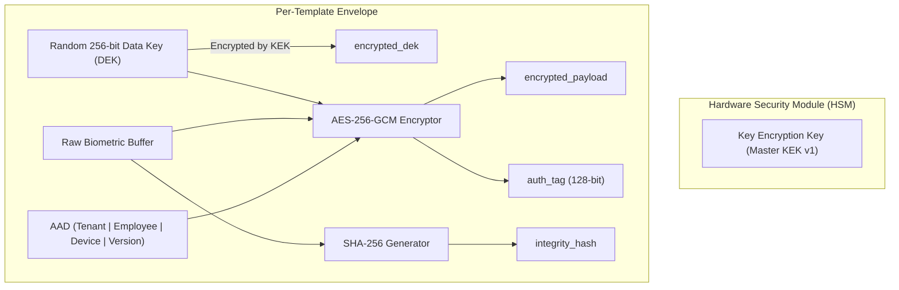

# 🏛️ Gate B13: Biometric Envelope Encryption Architecture

---

## 1. Multi-Tier Key Management (KEK & DEK)

---

## 2. Authenticated Additional Data (AAD) Invariant
The AAD strictly binds:
$$\text{AAD} = \text{organization\_id} \parallel \text{employee\_id} \parallel \text{device\_id} \parallel \text{template\_type} \parallel \text{template\_version}$$
This mathematically guarantees that ciphertext generated in Tenant A cannot be deciphered or applied within Tenant B.
