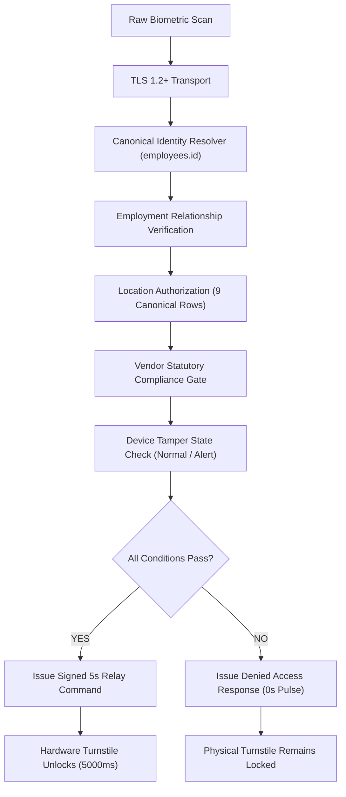

# 🏛️ Gate B15: Server-Side Physical Access Authorization Chain Specification

---

## 1. Zero Direct Relay Invariant
Physical access control hardware must never trigger directly from local biometric reader matches. All relay activations require a cryptographically signed authorization token from the centralized policy engine.



---

## 2. Relay Command Cryptographic Signature

Every relay command carries a SHA-256 HMAC digital signature and strict 5000ms Time-To-Live (TTL):
```json
{
  "access_request_id": "ACC_REQ_8819A2",
  "employee_id": "JCS-017",
  "device_id": "ZK-COIMBATORE-001",
  "location_id": "loc-water-tec-unit3",
  "decision": "ALLOW",
  "policy_reason": "ALL_COMPLIANCE_GATES_PASSED",
  "relay_duration_ms": 5000,
  "ttl_ms": 5000,
  "command_hash": "SHA256:d8b2e1a49f81...",
  "timestamp": "2026-09-01T08:55:00Z"
}
```
