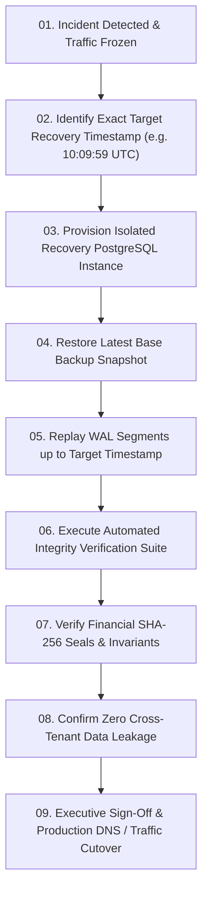

# 🏛️ Joy PeopleHR — Gate R10: Continuous WAL & Point-in-Time Recovery (PITR) Master Runbook

---

## 1. Incident Classification & Trigger Criteria
* **Severity 1 (Disaster)**: Catastrophic database corruption, accidental table drop, or widespread unrecoverable data deletion.
* **Recovery Point Objective (RPO)**: $< 1 \text{ minute}$ (via continuous PostgreSQL Write-Ahead Logging).
* **Recovery Time Objective (RTO)**: $< 30 \text{ minutes}$ to full production restoration.

---

## 2. Recovery Authorization Protocol
* **Required Authorizers**: Lead Architect + Chief Information Security Officer (CISO) + Head of Operations.
* **Pre-Execution Freeze**: All inbound API traffic and biometric ingestion streams immediately frozen (`HTTP 503 Maintenance Mode`).

---

## 3. Step-by-Step PITR Recovery Execution Workflow

---

## 4. Integrity Validation Steps
1. **Canonical Identity Check**: `SELECT COUNT(*) FROM public.employees` matches pre-incident baseline.
2. **Relationship Continuity**: `workforce_employment_relationships` and `contract_worker_deployments` contain 0 orphan records.
3. **Financial Immutability Check**:
   $$\text{stored\_calculation\_hash} == \text{SHA256}(\text{canonical\_sorted\_invoice\_snapshot})$$
   $\rightarrow$ **0 Hash Mismatches**.
4. **Tenant Isolation Check**: Queries with Tenant A JWT token cannot access Tenant B rows (HTTP 403 / 0 rows).
5. **RLS Policy Verification**: All 52 operational tables have `rowsecurity = true`.

---

## 5. Rollback and Cutover Verification
* **Post-Recovery Health Check**: `/api/health` returns `200 OK`, `status: "ok"`, `security_engine: "active"`.
* **Biometric Heartbeat Sync**: Biometric edge gateways reconnect within 30 seconds and resume queued punch replay.
